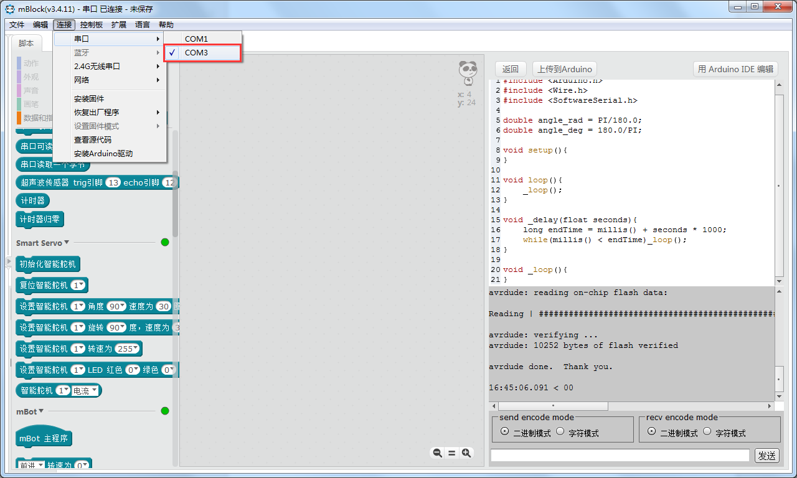
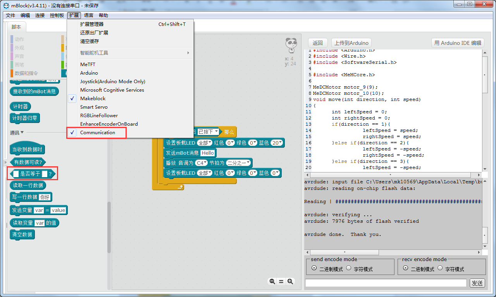
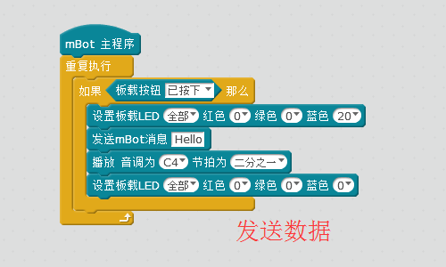
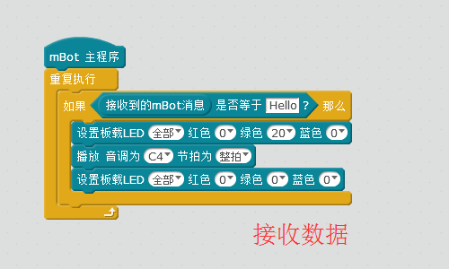
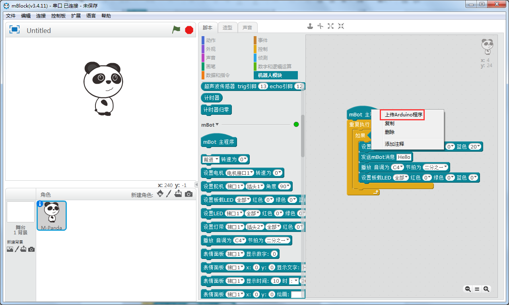
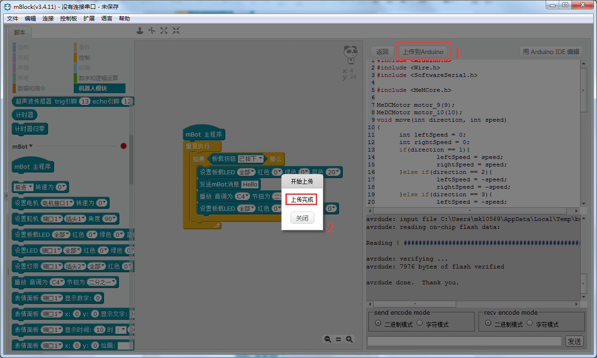
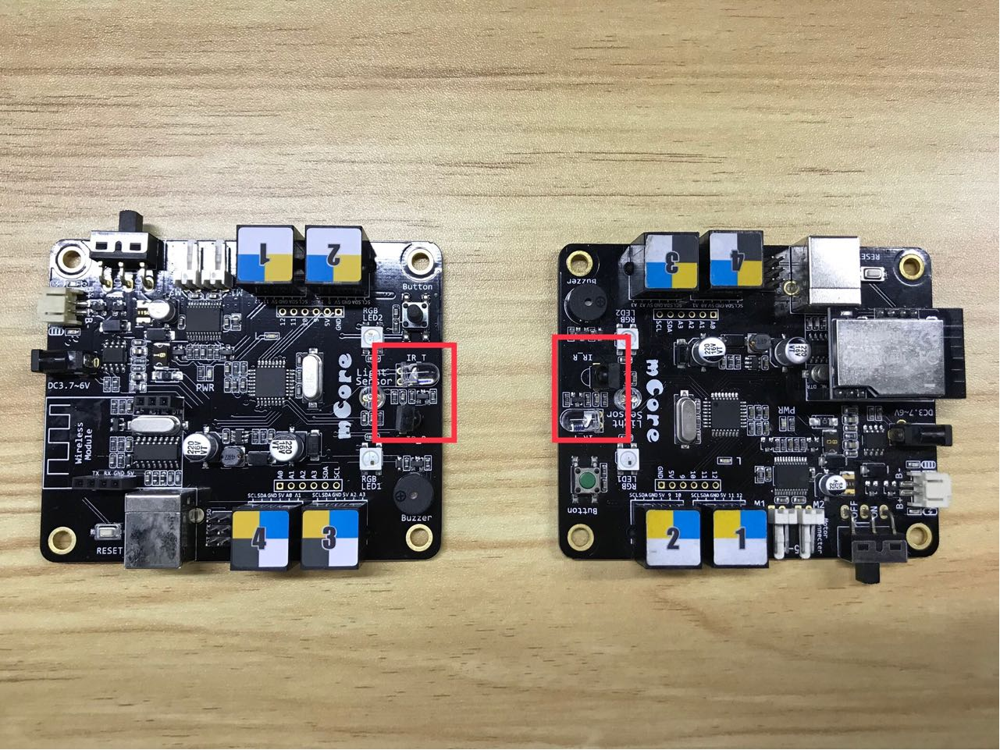

# 009\_两台 mBot 之间如何进行红外通信？

#### 软件部分

本文的示例是基于 mBlock3 环境下的测试，请确保电脑上已安装好[mBlock3](http://www.mblock.cc/zh-home/software/mblock/mblock3/)（[点击](http://www.mblock.cc/zh-home/software/mblock/mblock3/)下载）。

#### 硬件部分

首先你手上得拿到两台正常工作的 mBot，一台安装好 mBlock v3.4.11的电脑，外加一根 USB 线（**后面通过电脑烧录固件用到**）。

本文的示例要实现以下功能：

**通过其中按下其中一台 mBot 的板载按钮，让其发送一条内容为"Hello"的消息，并赋予其声光效果，当另外一台 mBot 收到这条"Hello"消息后，作出相应的声光效果反馈。**

具体步骤如下：

1、打开mBlock软件，选择好对应的主板和串口（以你电脑上的实际串口为准，可参考[如何查看主板的「COM口」？ ](tips/ru-he-cha-kan-zhu-ban-de-com-kou.md)）： 

2、按照步骤 1 的连接方式，分别连接两台 mBot，分别编写如下的图形化程序（**编写代码前记得在"扩展"菜单勾选"communication"扩展，否则会出现错误提示**）：

3、将以下两个不同的图形化程序分别烧录（在**"mBot主程序"**处右击选择**"上传到Arduino"**上传）到两台mBot 上面，出现下图中**"上传成功"**的字样表明我们程序烧录成功；

4、为了便于区分，我们将上传了"发送数据"程序的那台 mBot 命名为 mBot1，"接收数据"的那台命名为mBot2，程序都上传完成后，我们重新启动两台 mBot，然后按下 mBot1 上的板载按钮，猜猜会出现什么现象？

注：由于示例用的是红外通讯方式，所以要尽量保证二者的红外发射与接收传感器保持面对面（**如上图**）的条件，这样才不会影响数据的传输，**示例只是给出了一种使用方式，你可以参考示例程序写出更多好玩的代码**，还在等什么赶紧去试试吧！

