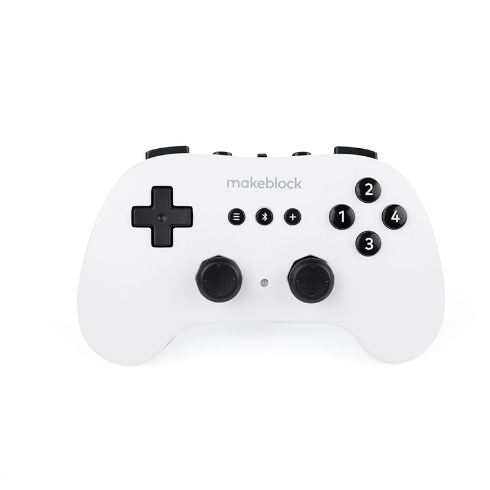
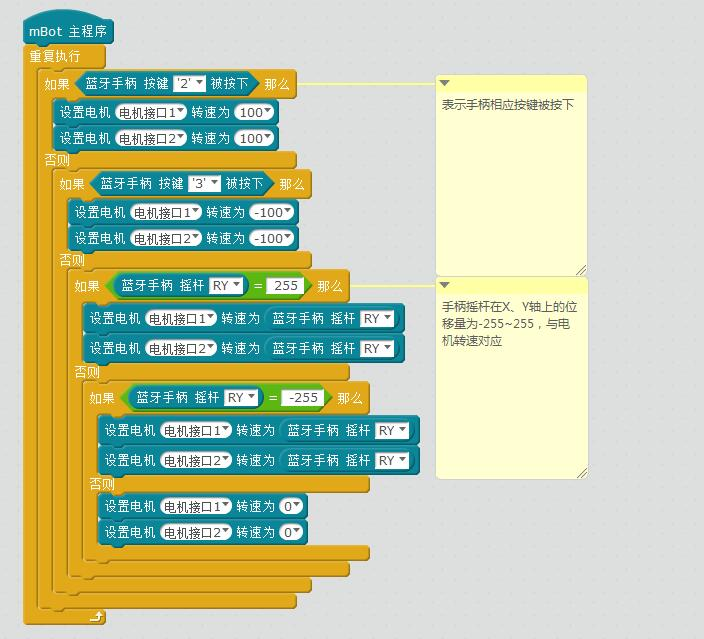

# 008\_如何通过蓝牙手柄控制机器人？

跟前面提到的 2.4G 无线手柄一样，蓝牙手柄通过电脑端的 **mBlock 软件**编程后，同样能实现对机器人的无线控制，以此来替代手机 App 和红外遥控器等控制方式。它的外观如下图：

目前该蓝牙手柄支持 mBot、Ranger、airblock 三种机型。

**需要注意的是，前两种机型在出厂程序模式下，并不支持蓝牙手柄直接控制机器人，如前面提到的，需要在电脑端 mBlock 里编写相应控制程序后，上传到机器人主板，才能成功实现手柄控制。**下面分两部分来介绍各机型无线控制的实现方式。

#### 1、控制 mBot 、Ranger

编写程序的具体步骤，可参考[蓝牙手柄使用手册](http://download.makeblock.com/CN-Bluetooth%20Controller_User%20Manual.pdf)，这里以 mBot 为例，简要介绍下大致步骤。

下图是参考使用手册编写好的 mBot 控制程序，可参考作相应的修改：

以上程序编写完成后，通过 USB 线将 mBot 的主板连接至电脑，然后上传该程序至主板，待「**上传完成**」字样出现后，重启 mBot 并与蓝牙手柄配对成功，即可实现手柄控制。

> 上传程序的步骤可[参考如何让程序「脱机运行」？](tips/ru-he-rang-cheng-xu-tuo-ji-yun-hang.md)

#### 2、控制 airblock

用手柄控制 airblock 的方式，跟前两种机型有些许不同，只需确保 airblock 的固件是最新的即可。具体检测方式为：**将 airblock 与 「makeblock」App 进行蓝牙连接，连接成功后进入 App 的「固件信息」菜单，视具体情况升级固件，如若提示固件已是最新，那它即是支持蓝牙手柄控制的。**

蓝牙手柄的各按键功能以及更多的使用说明，可参考[蓝牙手柄如何控制 airblock](http://cdnlab.makeblock.com/Airblock&%E8%93%9D%E7%89%99%E6%89%8B%E6%9F%84_%E6%93%8D%E4%BD%9C%E6%8C%87%E5%BC%95.pdf) 。

