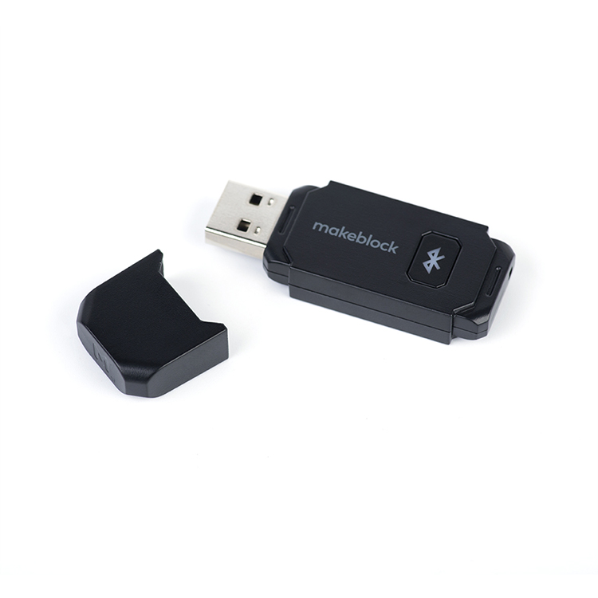
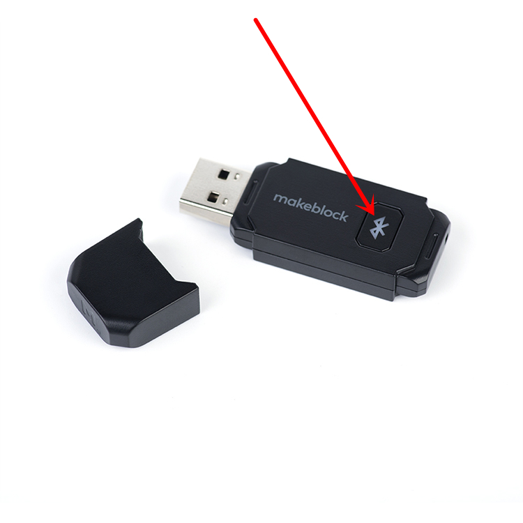
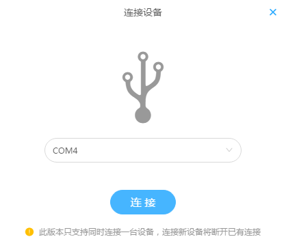
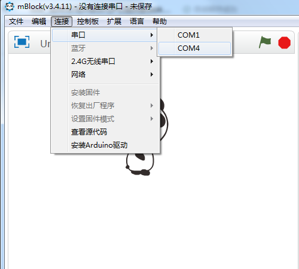

# 009\_如何实现 mBot 与 PC 端 mBlock 的无线通信？

> 手机端与 mBot 通讯的方式，想必大家都有所了解了，在手机端安装 makeblock 的一款应用软件后，通过手机蓝牙与 mBot 上面的蓝牙模块连接，二者实现蓝牙无线通信，以达到无线遥控或者自定义编程的目的。

PC 端的 mBlock 与 mBot 之间的通讯方式有两种，**有线通讯（USB线）和无线通讯**。

相信很多人都跟笔者有过类似遭遇，在通过 USB 线给 mBot 上的电机编程时，出现小车拖着 USB线跑的情况，以及需要不断插拔USB线的烦恼。

那为了解决这种困扰，makeblock 推出了两种无线连接方式，供大家选择——蓝牙和 2.4G 无线通讯。下面就跟笔者一起来了解下两种方案：

#### 1、2.4G方式

2.4G 模块套装如下图所示，白色的 USB 端子插在电脑端，黑色的模块插在 mBot 的主板上面。

需要说明的是，2.4G 方式只能实现 mBot 与 mBlock 之间的「**在线编程**」功能，并不能上传自定义程序到主板上，让其脱机运行——也就是我们常说的**「离线编程」**。

> 「在线编程」和「离线编程」的区别可参考[二者的区别](tips/shen-me-shi-zai-xian-bian-cheng-he-li-xian-bian-cheng.md)。.

另外，在使用 2.4G 方式时，必须先用 USB 线将mBot连接至电脑，进行**「安装固件」**这一步骤，待这一步骤完成后再拔掉 USB 线，进行 2.4G 无线串口方式连接，具体使用方法可参考[2.4G模块使用教程](http://v.youku.com/v_show/id_XOTQ1OTc3MDUy.html?beta&from=y1.7-2)。

> 「安装固件」可参考[如何「安装固件」？](tips/ru-he-an-zhuang-gu-jian.md)

#### 2、蓝牙方式

使用蓝牙方式的话，首先需要购买 makeblock 官方出品的蓝牙适配器（如下图所示），该适配器具有传输效率高、信号更稳定等特点，**并且能同时实现「在线编程」和「离线编程」两种功能（ 2.4G 方式不具备「离线编程」功能）**。

**使用方法：**

首先，将蓝牙适配器插入电脑主机的 USB 接口，此时适配器上面的指示灯慢闪。

打开 mBot 主板上的开关，按下蓝牙适配器上的按钮（如下图所示），适配器上的指示灯**闪烁频率加快**，进入配对状态。

将 mBot 靠近蓝牙适配器，二者将进行自动配对。此时适配器上的指示灯由快速闪烁变成常亮状态，即代表蓝牙配对成功。

查看当前使用的 mBlock 版本，根据如下提示开始「串口」连接。

**mBlock5** 选择蓝牙适配器当前使用的串口，开始连接设备。

 **mBlock3** 选择蓝牙适配器当前使用的串口，开始连接设备。

如果蓝牙适配器无法被电脑识别出串口，可参考[如何查看主板的「COM口」？](tips/ru-he-cha-kan-zhu-ban-de-com-kou.md) 安装驱动文件解决。

