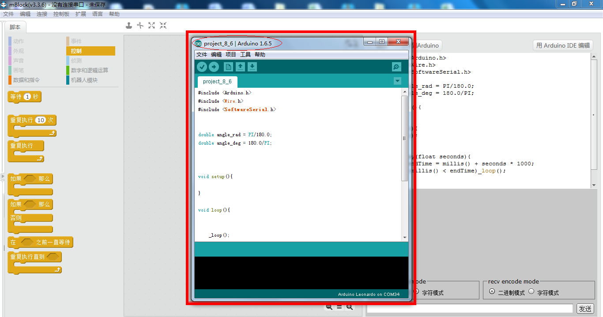
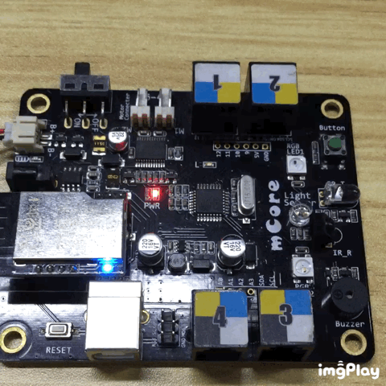

# 012\_如何检测主板是否工作正常？

> 有时候，我们在通过 PC 版 mBlock 给机器人编程的过程中，会出现上传程序到主板后，机器人还是运行上一次编写的程序，亦或者是出现「上传失败」等错误提示信息。

这时我们可通过下面一系列操作，验证一下是使用方法不对，还是主板自身的硬件出了问题。

 1、打开 mBlock 软件,如下图所示（如未安装软件请[点击](http://www.mblock.cc/zh-home/software/mblock/mblock3/)下载安装）：

2、在「编辑」菜单中选择 「**Arduino 模式**」：

3、在右上角选择「**用 Arduino IDE 编辑**」： 

 4、选择对应的主控板

1） mBot 、Starter 机型选择「**Arduino/Genuino Uno**」:

2）Ranger、Ultimate 2.0 机型选择「**Arduino/Genuino Mega**」：

5、用 USB 线连接主板至电脑，选择对应的端口

> 端口选择可参考[如何查看主板的「COM口」？](tips/ru-he-cha-kan-zhu-ban-de-com-kou.md)

6、选择示例程序

1）选择「**文件**」菜单

2）文件下拉菜单选择「**示例 -&gt; Basics -&gt; Blink**」

7、最后一步，点击「**上传**」按钮，等待上传，**并注意下方是否有无红色报错信息**。

 以 mBot 的主板为例，**如果主板工作正常的话，那么程序上传过程中，不会出现任何报错信息**，并且上传完成后，主板会有如下运行效果（**主板上的蓝色 L 指示灯保持持续闪烁**）：

