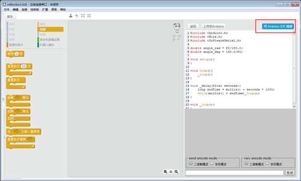

# 001\_如何给麦轮上传固件？

由于 mBlock3 自带了 Arduino IDE 和官方库，因此为了省去安装 IDE 和库文件的麻烦，此文档的软件环境基于 mBlock3，如未安装该软件，[点击](http://www.mblock.cc/zh-home/software/?noredirect=zh-CN)下载安装。

首先，打开 mBlock 进入「Arduino 模式」如下图所示。

接下来，[点击](https://github.com/Makeblock-official/Mecanum-Wheel-Robot-Kit)下载麦轮使用的程序文件。

程序下载完成解压后，通过已经打开过的 Arduino IDE 导入下图红框内的程序。

程序导入后，选择主控板为「Arduino Uno」，然后选择对应的端口（每台电脑端口可能不一样），可参考[如何查看主板的「COM口」？](../tips/ru-he-cha-kan-zhu-ban-de-com-kou.md)。

点击左上方的上传按钮，等待程序上传完成。

