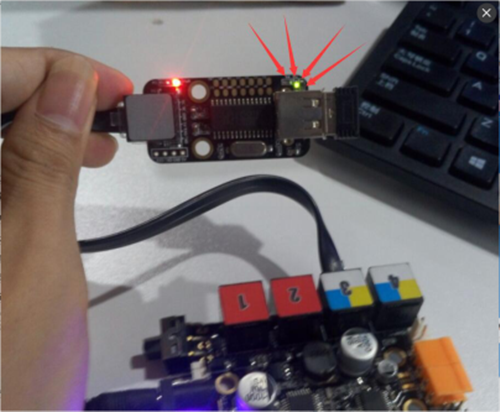
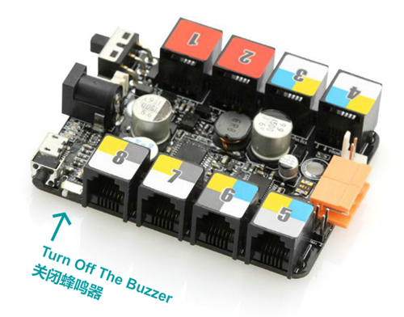
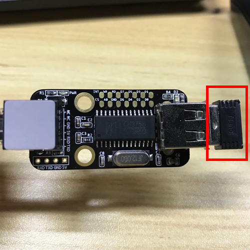

# 002\_为何手柄无法与 USB Host 模块成功配对？

#### 现象：

遥控手柄无法与 USB Host 模块成功建立起连接，该模块上始终只有电源 PWR 指示灯亮起。

二者成功配对后，正常情况应该是遥控手柄亮起绿灯，USB Host 模块亮起两颗灯指示灯同时亮起（如下图红绿两灯）。

#### 解决方法：

首先，打开遥控手柄开关，然后确保 USB Host 模块接在 Orion 主控的接口 3 上，并且主板上蜂鸣器的开关置于「off」处，如下图所示。

完成上述步骤后，若 USB Host 模块上面还是只有一颗指示灯亮起，可采取重复插拔该模块上黑色接收器（下图红框中）的方式，或是尝试按下 Orion 主控上的黑色 Reset 键，即可实现文档最开始提到的——两颗指示灯同时亮起的效果。

