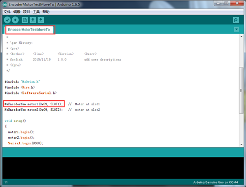

# 003\_为何手柄无法正常遥控麦轮车？

1、首先，参考[001\_如何给麦轮上传固件？](001-ru-he-gei-mai-lun-shang-chuan-gu-jian.md)给麦轮车上传程序。

2、待程序上传完成后，分别给主板和两块电机驱动板接上电源线。然后打开主板和驱动板上的开关，正确的供电顺序为：断电状态下，先打开两个大功率电机驱动板的开关，最后再打开 Orion 主板上的总开关。上电完成后，可手动按一下主板的 Reset 按键复一下位。

3、参考[002\_为何手柄无法与 USB Host 模块成功配对？](002-wei-he-shou-bing-wu-fa-yu-usb-host-mo-kuai-cheng-gong-pei-dui.md)检查遥控手柄和 USB Host 接收端子是否正常配对。

若以上步骤均正常，但是手柄还是无法正常操控麦轮车，可通过官方库（[下载](http://www.mblock.cc/zh-home/software/?noredirect=zh-CN)最新版 mBlock3 即自带官方库）提供的示例程序，验证下主板和电机驱动板这俩硬件是否正常工作。

我们采取交叉测试的方式，即每次测试时主板只接一个电机驱动板和编码电机，来排查硬件问题。

比如，现在要对主板端口 1 上驱动板的接口 1 处的电机进行测试，确认供电和接线正常后，上传下面这个「EncoderMotorTestMoveTo」示例即可。 

> 0x09 代表电机驱动板的 I2C 地址（出厂默认），无需修改。SLOT1 代表电机驱动板的接口 1，可根据电机的实际接线情况进行修改。

