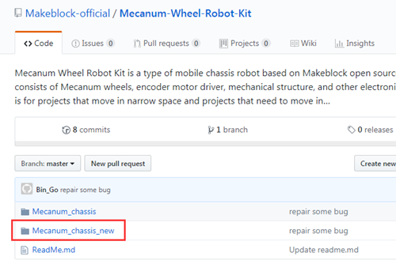
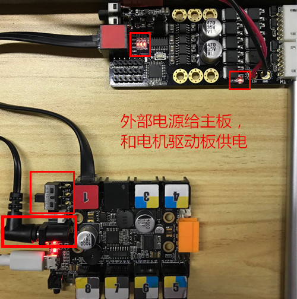
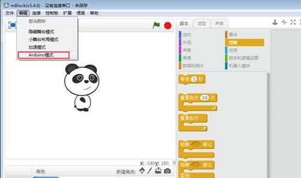
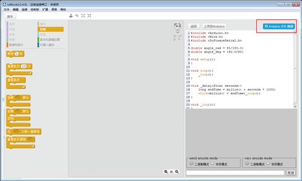
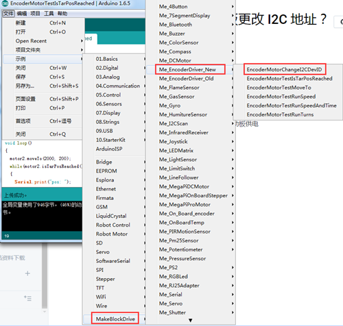
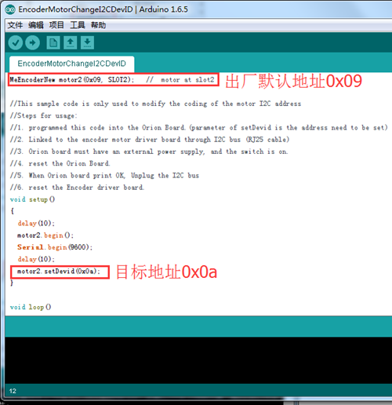
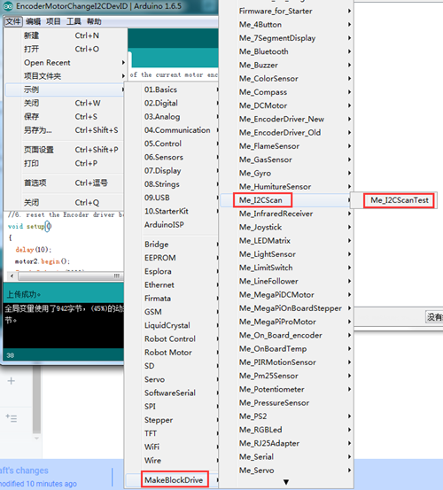

# 004\_如何给麦轮的驱动板更改 I2C 地址？

> 为了使麦轮车有更高的工作精准度，通过更改其中一个驱动的 I2C 地址，并升级脉轮[最新](https://github.com/Makeblock-official/Mecanum-Wheel-Robot-Kit)的固件（下图红框中）即可实现。

1、首先，[下载](http://www.mblock.cc/zh-home/software/?noredirect=zh-CN)最新版的 mBlock3，因为它自带了我们在修改 I2C 地址时用到的一些程序，这样便省去了安装官方库文件的步骤。

2、断电状态下，将其中一块驱动板的接线从主板断开，即主板上只连接一块电机驱动板。

3、使用外部电源给主板和驱动板分别供电，正常供电时，主板和电机驱动板上的指示灯显示如下图（一定要同时给二者供电，否则修改可能不生效）。

4、打开 mBlock3，进入 Arduino IDE 模式。

5、选择「EncoderMotorChangeI2CDevID」示例程序。

6、打开该程序后，找到我们要修改的两个地方。「出厂默认地址」改为 0x09，「目标地址」改为 0x0a。

7、修改完成后，用 USB 线将主板连接至电脑，选择好主控板（Arduino Uno）和端口（以实际显示为准），进行程序上传。

8、上传完更改 I2C 地址的程序后，记得要按一下电机驱动板上的白色 RESET 按键或者给驱动板断电重新上电，以达到复位的目的（复位后我们所做的修改才会生效）。

9、要查看 I2C 地址是否更改成功了，可以找到并上传「Me\_I2CScanTest」示例。

10、上传成功后，不要拔下主板上的 USB 线，直接点击右上角的串口监视器按钮，查看当前读取到的 I2C 地址。

至此，整个修改过程完成，现在你两块驱动板的 I2C 地址，其中一个为 0x09，另一个是 0x0a。

这时候就可以为麦轮上传「Mecanum\_classis\_new」固件了，上传该固件后，麦轮即可达到更为精准的移动。

