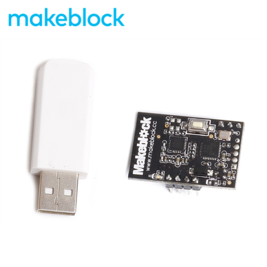
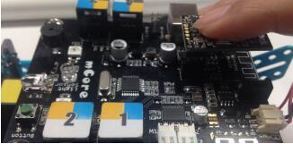
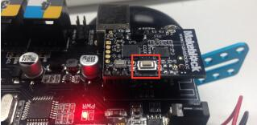
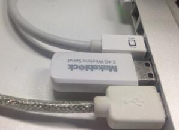
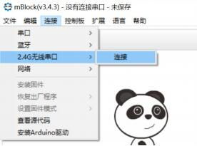
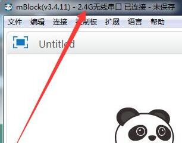
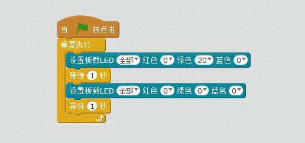

# 002\_2.4G 版本的 mBot 如何使用？

 2.4G 模块组件（如下图）是用来无线控制机器人的一种很好方式。它包括一个插在电脑 USB 接口的白色适配器，和一个插在机器人主板上的黑色电子模块。

#### 使用方法 {#shi-yong-fang-fa}

1、将 mBot 用 USB 线连接至电脑，进行「安装固件」这一步骤，具体操作可参考[如何「安装固件」？](../tips/ru-he-an-zhuang-gu-jian.md)

2、将黑色的 2.4G 模块插到机器人主板上，并打开机器人电源。

3、按下 2.4G 模块顶部的按钮，此时指示灯会从慢闪状态变成快闪状态。

4、 在 2.4G 模块指示灯快速闪烁的时候，将白色适配器插入电脑。这时能看到指示灯常亮，代表已经配对。

5、 选择「连接-&gt; 2.4G 无线串口-&gt;连接」。

6、连接成功后，左上角会出现「2.4G 无线串口 已连接」的字样。

7、编写你的第一个在线程序，点击绿旗让它运行看看效果。

#### 常见问题解答 {#chang-jian-wen-ti-jie-da}

**Q1：为什么我用 2.4G 写程序，小车没反应？**

A1：对于我们来说，2.4G 模块的主要用处就是用来「**在线编程**」（不可用于上传程序），在进行「**在线编程**」之前，我们需要先用 USB 线将机器人连接至电脑后，进行「**安装固件**」这一步骤后才可实现**无线通讯**。「**安装固件**」部分可参考[如何「安装固件」？](../tips/ru-he-an-zhuang-gu-jian.md)

**Q2：如要让机器人恢复到出厂时的状态，该怎么做？**

A2：在 mBlock 里面恢复出厂程序即可，具体操作可参考​[如何「恢复出厂程序」？](../tips/ru-he-hui-fu-chu-chang-cheng-xu.md)

