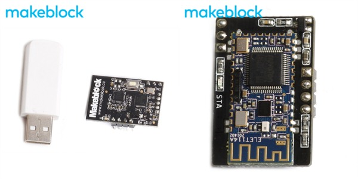
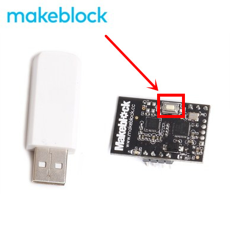

# 002\_2.4G 版本的 mBot 如何使用？

在网上看到很多人将 2.4G 模块和蓝牙模块混淆了，这里再着重强调一下二者的区别。

废话不多说，咱直接上图，下图**左边**一黑一白的套装为 **2.4G 模块（只可实现电脑与 mBot 之间通信）**，右图为蓝牙模块：

#### 使用方法

如果是第一次接触 2.4G 模块，可参考[这个视频](http://v.youku.com/v_show/id_XOTQ1OTc3MDUy.html?beta&from=y1.7-2)来学习该模块的用法。

#### 常见问题解答

**Q1：有好几对 2.4G 模块搞混了，配对不起来了怎么办？**

A1：接在小车上黑色的 2.4G 模块上面有个白色按键（如下图），按下它后，该模块上的蓝色 LED 灯会由慢闪变为快闪，这时候将白色的 USB 端子插上电脑，即可完成配对。

**Q2：为什么我用 2.4G 写程序，小车没反应？**

A2：对于我们来说，2.4G 模块的主要用处就是用来「**在线编程**」（不可用于上传程序），在进行「**在线编程**」之前，我们需要先用 USB 线将机器人连接至电脑后，进行「**安装固件**」这一步骤后才可实现**无线通讯**。「**安装固件**」部分可参考[如何「安装固件」？](../tips/ru-he-an-zhuang-gu-jian.md)

**Q3：为什么 2.4G 模块上面的蓝色 LED 灯一上电就保持常亮了，但在软件里也连不上「2.4G 无线串口」？**

A3：有可能是 2.4G 模块烧坏了，如在保修期内，联系下您的卖家确认后进行保修或更换。

