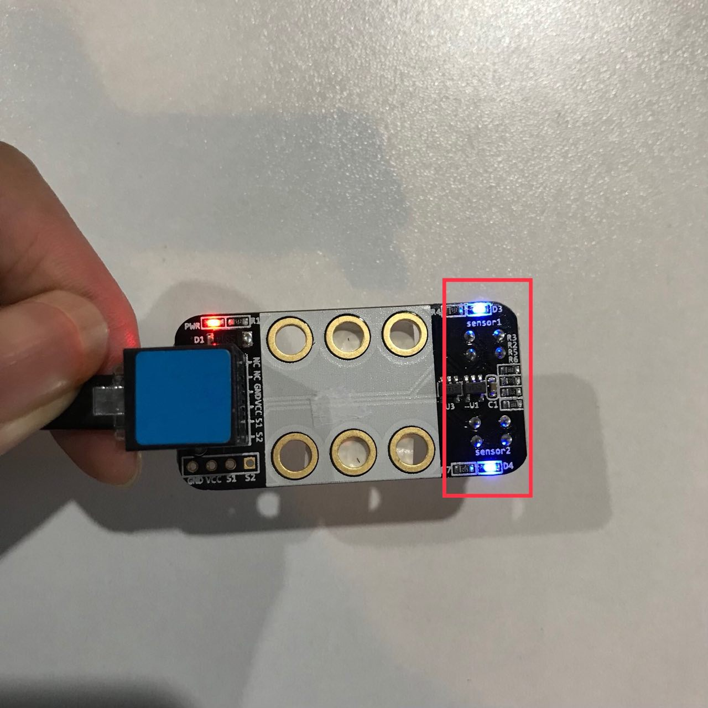
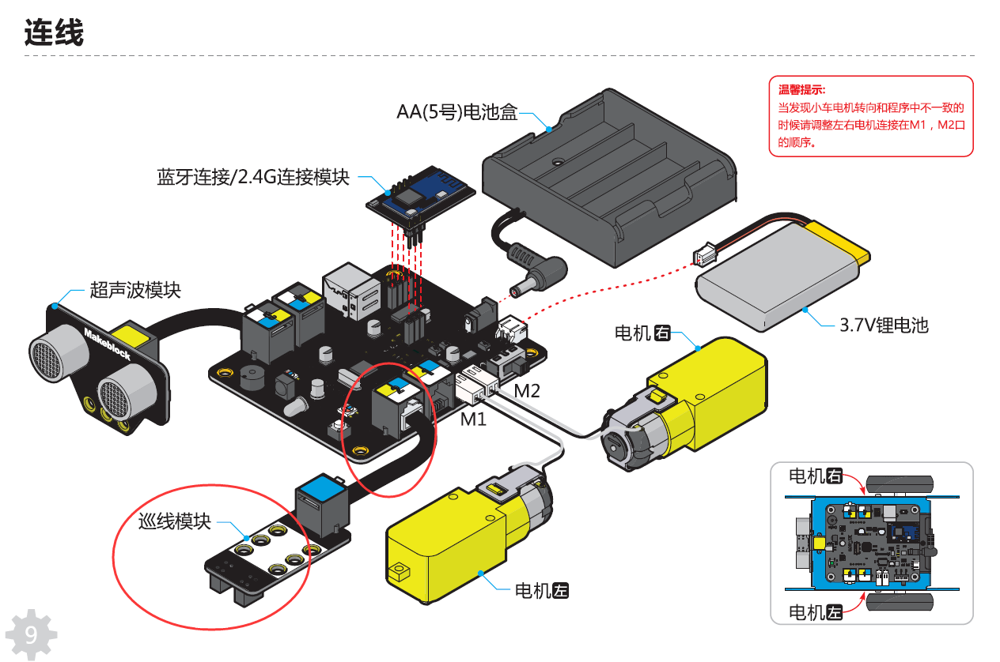
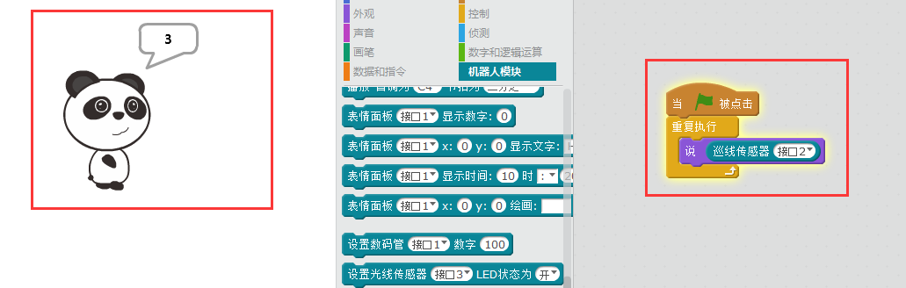

# 003\_巡线模式为何工作不正常？

> 首先需要提到的一点是，建议将巡线地图放在光线稍弱一些的地方测试，光线太强的地方巡线效果可能不太理想。

在使用巡线模块时，如果 mBot 上已有巡线程序，小车还是无法完成巡线任务，可通过以下方式，对巡线模块进行检查：

####  1、检查模块本身的好坏

这里有个简单的方法，可以来验证下巡线模块正常工作与否：

将巡线模块插上主板接口，给 mBot 上电后，将其靠近白纸或者白色桌面，观察下巡线模块上面的**两颗蓝色LED灯**的亮灭情况（正常应为靠近桌面或白纸 1cm 左右两灯均亮，远离桌面两灯均灭**如下图**）：  

**若未出现上述现象，可为巡线模块更换 RJ25 线或插到主板的其他接口，以此验证是否是主板供电问题。**

####  2、检查接线问题

在使用 mBot 的出厂巡线模式时，巡线模块应该接在主板的 2 号端口，否则会出现巡线不成功的现象。

如果出厂程序的巡线模式还是无法正常巡线，可尝试「恢复出厂程序」看下。

> 具体可参考[如何「恢复出厂程序」？](../tips/ru-he-hui-fu-chu-chang-cheng-xu.md)

如果是自己编写的巡线程序，可检查下巡线模块的接线口是否与程序中的一致。

#### 3、通过mBlock软件读取返回值

通过 mBlock 软件（[点击](http://www.mblock.cc/zh-home/software/mblock/mblock3/)下载）来读取巡线模块返回的数据，一共分为两步：

第一步，也是必备的步骤——「安装固件」

> 具体可参考[如何「安装固件」？](../tips/ru-he-an-zhuang-gu-jian.md)

待第一步成功完成后，编写并**点击绿旗运行如下程序**，从而获得巡线模块的在不同状态下的返回值，正常模块在不同情况下（靠近白纸和远离白纸）会读得 0、1、2、3 四种数值。

