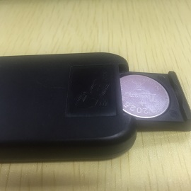
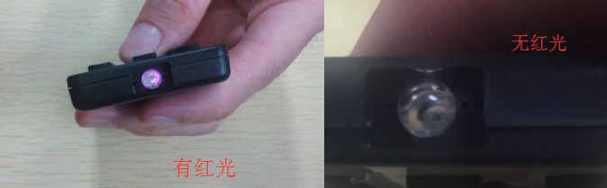
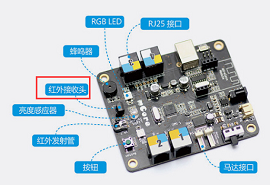
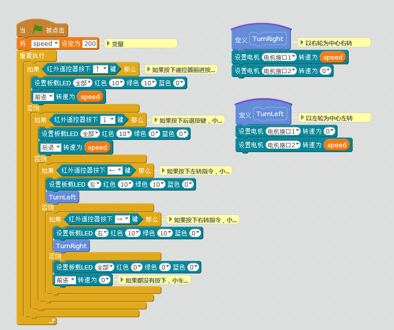

# 006\_mBot 的红外遥控器为何不工作？

> 如已给 mBot 上传过自己写的程序，先按照 如何「如何恢复出厂程序」部分恢复下出厂程序，因为本文的操作均是基于 mBot 出厂程序的遥控模式。

在出厂程序下，如遇到红外遥控器无法正常控制 mBot ，确认 mBot 被正常供电后，可按照以下顺序逐一检查：

#### 1、遥控器无电池或电池装反

打开遥控器背面的后壳，检查下电池是否装反，电池的正确放置方式如下图：

#### 2、电池没电

遥控器的电池没电了，可更换新的电池看下，电池型号为：**CR2025**，可上淘宝或当地电子市场购买。

#### 3、遥控器无红外信号输出

检查遥控器有没信号输出，打开手机摄像头（亲测苹果手机不支持，要用**安卓手机**测试），遥控器对着镜头按任意键，如下图，如有红光，则证明遥控有信号输出，遥控器没问题，继续看第 4 点：

#### 4、红外接收头掉落

mBot 主控板的红外接收头（参考下图），出现掉落或者无法工作的现象，这种情况可以联系下卖家。

####  FAQ&Tips

**Q1：两台以上 mBot 在一起，红外遥控会干扰？**

红外遥控两台在一起是会干扰的，无法避免。即使通过程序编写不同的按键值也不行，因为同一个遥控器发出的信号，在附近的 mBot 小车都能接收到（即使程序上没有写那台小车的程序），都会受到干扰。所以红外遥控只适合单独一台小车使用。如需多台使用，如 mBot 足球赛，可以使用 2.4G 或蓝牙模块通讯。

**Q2：如何给红外遥控器编写自定义程序？**

可参考下图中的示例程序（基于 mBlock3），对 mBot 上面的红外遥控器进行编程，然后上传程序到 mBot上面（**将图中的绿旗部分换成「mBot 主程序」**）。

> 上传程序步骤可参考[如何让程序「脱机运行」？](../tips/ru-he-rang-cheng-xu-tuo-ji-yun-hang.md)

