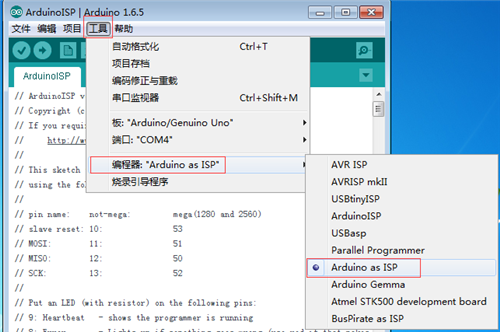
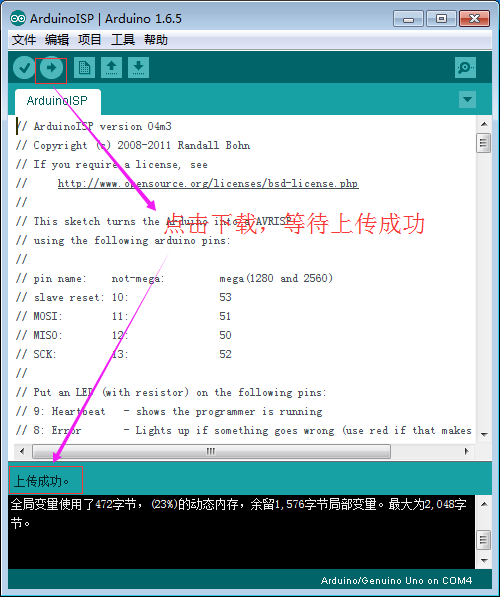

# 001\_如何对打印平台进行精确调平？

#### 现象：

打印第一层时打印平台上没有耗材出现、打印时耗材没有粘在平台上被喷嘴拖着走、打印质量特别差等现象,或者是喷头离打印平台特别远导致无法正常打印。

> 为了追求更完美的打印质量，我们开箱后都会对 3D 打印机进行打印平台调平操作，一般是建议参考随打印机附赠的调试视频（视频文件在附送的 SD 卡中）来进行操作，采用自动调平与手动调平相结合的方式来达到要求：

> 对一些客户对我们调平视频的错误理解纠正：「我 X、Y、Z三个轴都按照视频调好了，就是 center 的值一直调不好，Center 的值都调到 140 甚至更大了，喷头还是不能接触到纸。」上面的做法是错误的，肯定是理解为，只要过高（没接触纸）就加大 Radius 参数值，一直加一直加…

**当然，上面的理解其实是误解了视频所要传达的意思，下面我们来了解下正确的做法。**                                

正确的做法应该是：分别调整好X、Y、Z 三个参数值后，再调 Center 处时，如加大了一次 Radius 的值，发现还是高，又要返回去重新调整X、Y、Z 的值（因为改变了Radius 的值后，X、Y、Z 的三个参数的实际值已发生了变化）。再次调好X、Y、Z 后，继续观察 center 处的情况。如此交替反复循环调整，直到 4 个点都和视频上说的一样，和纸有适当的摩擦力。    

1、如下图，先用 A4 纸分别调好X、Y、Z 的三个值（根据打印头与平台的实际松紧程度来增大或减小对应的参数，针对这三个点（X Tower、Y Tower、Z Tower）——太松就减小参数值，太紧就加大参数值）。比如我的机器，调整好的三个值分别是 -9.3，-8，-8.6（**调整好各参数后记得点击“Set”按钮**），假定此时这三个点已能接触 A4 纸。                                                                                                                                                   

> 注：每个人调整好的参数可能会不同。

> 另外，有朋友反馈修改各参数后，打印机的实际状态看起来并未改变，也就是看起来修改后的参数并未起任何作用，这时候就需要检查下你的机械结构安装了，某些情况如x、y、z 三个轴的传送带不够紧时，有可能会造成调平软件时调节的参数值（X，Y，Z，Radius）看起来并未生效的现象。

2、点击Center，观察打印头状态。如发现太松了（喷头距离纸太高），就加大Radius 值，如我这里从118.0 调整到 118.5（**修改后点击旁边的「Set」按钮**）：

3、此时回头重新看下X Tower、Y Tower、Z Tower 三点的情况，你会发现这三个点距离打印平台应该又大了，此时重新调好X、Y、Z 三个参数的值（加大），如我的机器 ，X、Y、Z 的值重新调好后都有所增加了（-9.5，-8.3，-8.7），**调好X、Y、Z 三个值也需点击这三个参数旁边的「Set」 按钮：**

4、 继续点击 Center 观察，如喷头还是松（未接触纸），继续加大 Radius 的值，如 118.5 增大到 119 :

5、此时再回头重新看下X Tower、Y Tower、Z Tower 跟打印平台的距离，你会发现这三个点应该又高了（未接触纸），然后重新调好X、Y、Z三个参数的值（加大），如我的机器 ，X、Y、Z 的值重新调好后都有所增加了（-9.5，-8.5，-8.9）：

**按照上述步骤，通过修改相应参数以重复调整X Tower、Y Tower、Z Tower 、Center 这四个点，直到四个点都和视频上说的，和喷头有接触并有一定的阻力为止。**

**切记调整过参数（X、Y、Z、Radius 中任意一个）之后，都需点击对应的「Set」按钮，这样的话修改过的参数才会生效。**

