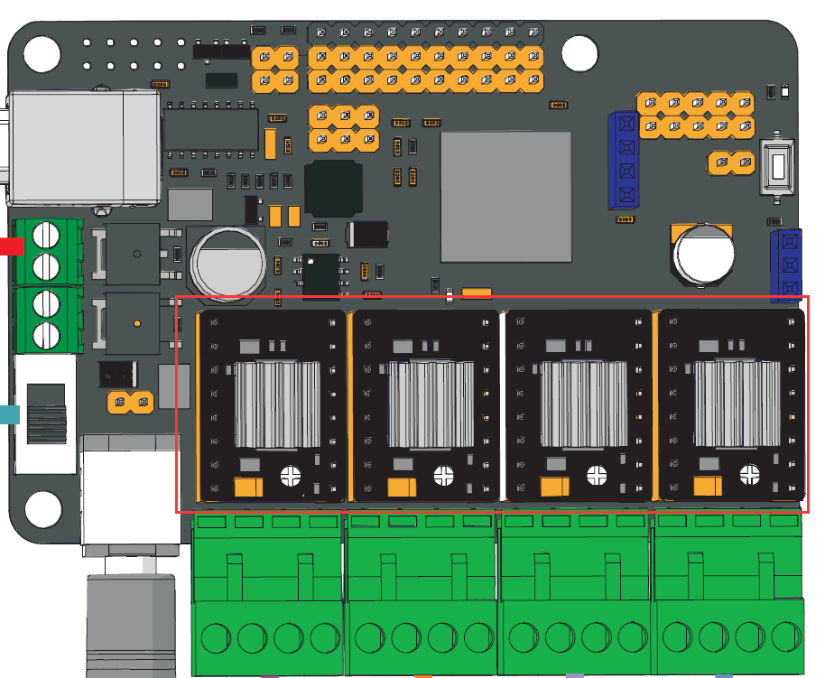
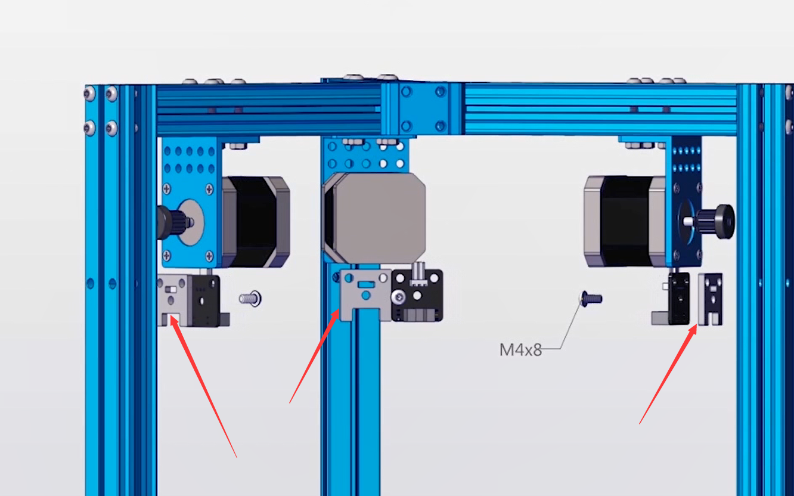

# 002\_为什么"AutoHome"\(复位\)功能不正常？

> 组装好 3D 打印机后，在正式使用之前，需要验证下 3D 打印机各步进电机是否工作正常，这时候就需要用到"Auto Home"功能了。

操作 LCD 面板里的「Auto Home」菜单后，可能会遇到以下两种故障现象：

1. 各个轴的电机完全不动
2. 电机运动方向不正确（正确方向是朝限位开关处移动）。

如果遇到以上两种现象时，可以对以下两点进行逐一检查：

1、步进电机的驱动模块没安装，将打印机先断电，然后将各个电机的驱动模块装好即可。另外，若遇到其中某个电机不动，可将其所在的电机驱动模块与其他电机的进行交换，以验证是驱动模块的问题还是电机自身的问题。

2、限位开关与金属梁之间**未安装亚克力板**，导致限位开关发生短路现象，进而无法正常工作，亚克力板的安装位置如下图：

遇到这种情况，可在包装内找到这三块亚克力板子，将其装在金属梁和限位开关之间，即可解决问题。

