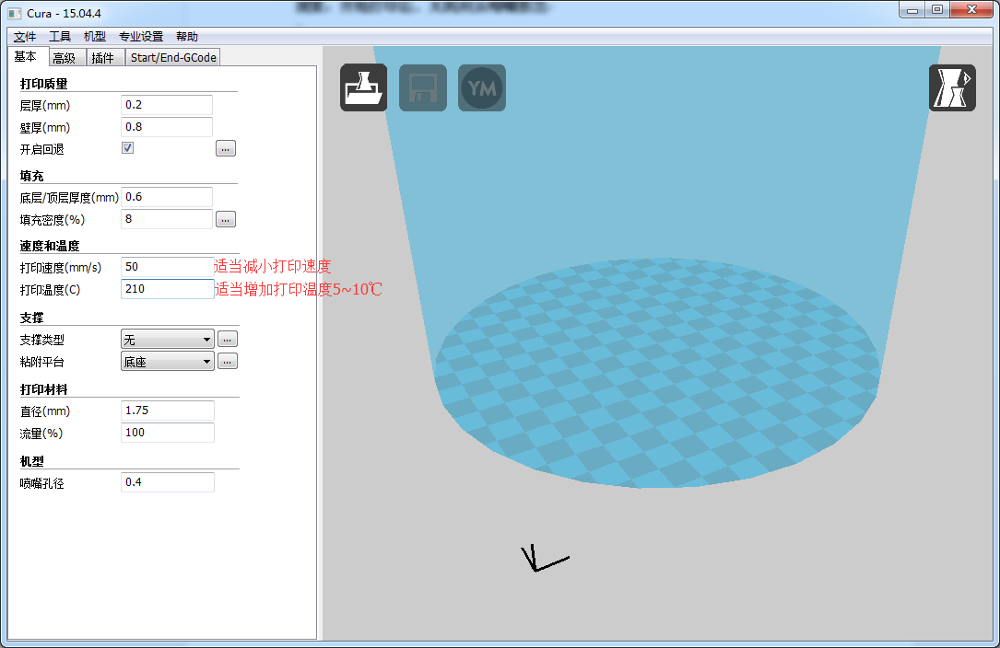

# 003\_为什么打印开始后不出料？

#### **现象：**

当打印开始后，始终无耗材从喷嘴挤出。

**原因①：喷嘴和打印平台间距过小**

如果喷嘴离平台太近，将导致没有足够的空间让耗材从喷头中挤出。喷嘴顶端的孔会一直被堵住，耗材无法出来。识别这种问题的一个简单方法是：看是不是第 1 或 2 层不挤出，但第 3 或 4 层左右，又开始正常挤出了。

**解决方法：**要解决这个问题，建议再次进行调平操作，使得喷嘴和平台的间距在误差范围。可参考[001\_如何对打印平台进行精确调平？](001-ru-he-dui-da-yin-ping-tai-jin-hang-jing-que-tiao-ping.md)解决该问题。

**原因②：耗材在挤出机齿轮上打滑**

喷头的内部原理主要是挤出齿轮推动线材前进或后退。齿轮上的齿咬入线材中，来精确地控制线材的位置。然而，如果你仔细观察耗材上的齿印，你会发现线材上，有些小段上没有齿印，这有可能是因为驱动齿轮刨掉了太多耗材。当这种现象出现时，驱动齿轮没法抓住线材，来前后驱动线材，这样的话，耗材也无法进入喷嘴挤出。

**解决方法：**解决这个问题，可以在切片软件 Cura 里面，适当降低打印速度或者增加挤出机的温度（一般是5 到 10℃）。

**原因③：耗材并未真正插入挤出机内部**

通常这种情况是因为耗材没有真正插入挤出机内部（即使加热挤出机后耗材也能轻松拔出，毫无被吸着的感觉，并且耗材无明显“熔化”现象），卡在了喉管（关于喉管位置可百度“ 3D 打印机挤出机结构”）的某个部位。

**解决方法：**遇到这个问题，可先将耗材从白色送料管拔出，通过 LCD 面板的相关菜单，将挤出机进行预热操作（Prepare-&gt;Preheat PLA），待预设温度达到后，将耗材顶端削尖（越尖越好）再进行插入操作。

**原因④：挤出机/喷嘴发生堵塞**

如果上面的建议都没法解决问题，那么有可能喷头堵了。可能是由于喷头散热不充分，耗材在预期熔化的区域之外，就开始变软了。

**解决：**要解决堵头的问题，可以先照着这个[视频](http://v.youku.com/v_show/id_XMTU4OTMwMDI2MA==.html?from=y1.7-2)操作一下，如若还是不成功的话，可能需要拆开喷头组件。所以在动手之前，请先与 Makeblock 官方进行联系，根据 Makeblock 工程师的指导进行操作。

