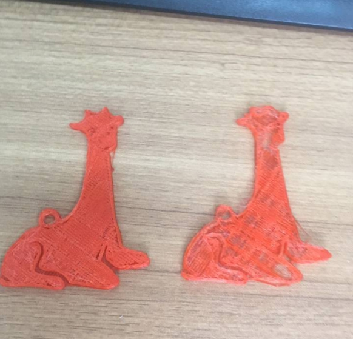
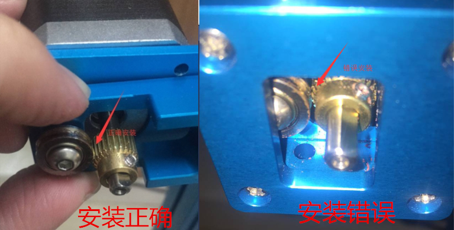

# 004\_为什么打印时出料不足？

#### **问题现象：**

打印时用手推动耗材辅助送料，打印出来的模型正常（下图左），而让其自己打印出来的效果不忍直视（下图右）。

#### **原因以及解决办法：**

 一般出现这个问题，有以下几个原因，可对打印机进行逐一检查。

 1、挤出机的步进电机驱动力不够，可跟其他轴的电机对下换驱动模块，以及重新插拔下挤出机的电机线两头看看。

 2、挤出机可能有轻微堵塞，以至于对送料形成阻力，进而导致出料不足。可在在 LCD 上操作，预热打印机\(**Prepare-&gt;Prepare PLA**\)，待目标温度达到后，采用手动送料的方式，看下打印头出料是否正常，如手动挤料阻力过大的话，建议使用原厂附送的**打印头清理针**清理下打印头喷嘴再进行打印。

 3、打印机的黄色挤出轮没装对位置（**挤出轮的齿轮应该对准轴承的 U 型槽**）时，有可能会造成打印时出料不足的情况，下图为正确安装方式与错误安装方式。

\*\*\*\*

