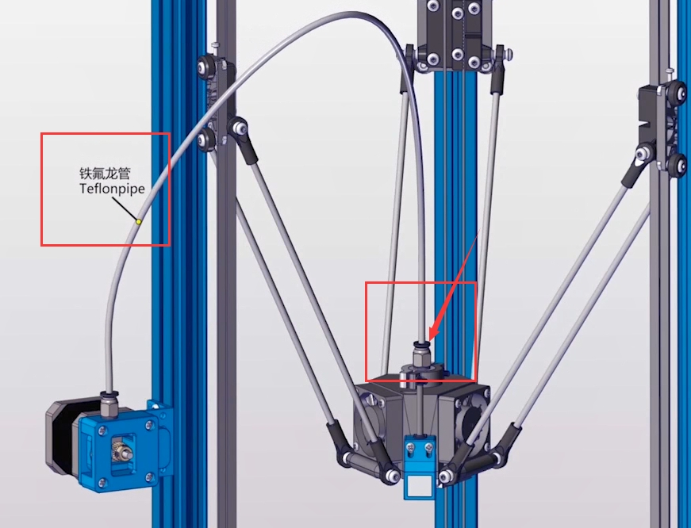
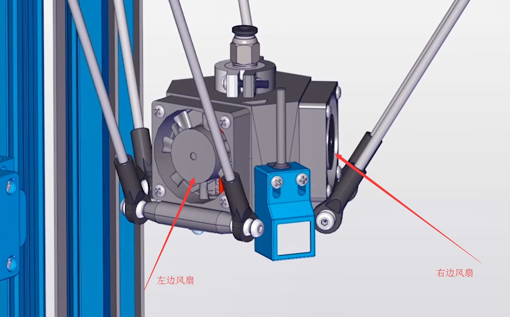
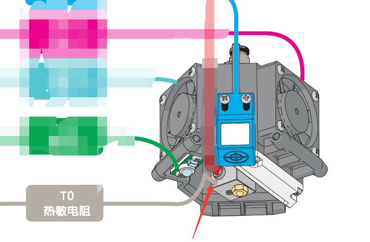

# 005\_为什么打印过程中停止出料了？

#### 现象：

打印前手动送料时，出料顺畅，正式打印后刚开始出料也正常，但是打着打着就不出料了。

出现这个问题，可能有以下几个原因：

#### **原因 ① 以及解决方法：**

挤出机处的白色铁氟龙送料管（下图红框中）未完全插入到挤出机底部，可尝试一手按住金属接头的黑色圆垫片（见图示箭头），另一手将白色管往里面插，直到不能再插入为止。

#### **原因 ② 以及解决方法：**

 检查散热管（螺旋状的金属部分）处的风扇（下图左边风扇，主要用于金属螺旋部分散热）是否正常工作（正常状态为上电后该风扇一直转动，如出现右边风扇一上电就转的情况，可将左、右风扇在主板上的接线调换一下）。

#### **原因 ③ 以及解决方法：**

 挤出机上的热敏电阻（下图红色箭头处）太过松动，导致在打印过程中温差过大（可在冷却状态下，手动拨动下热敏电阻，检查下其松紧情况）。

