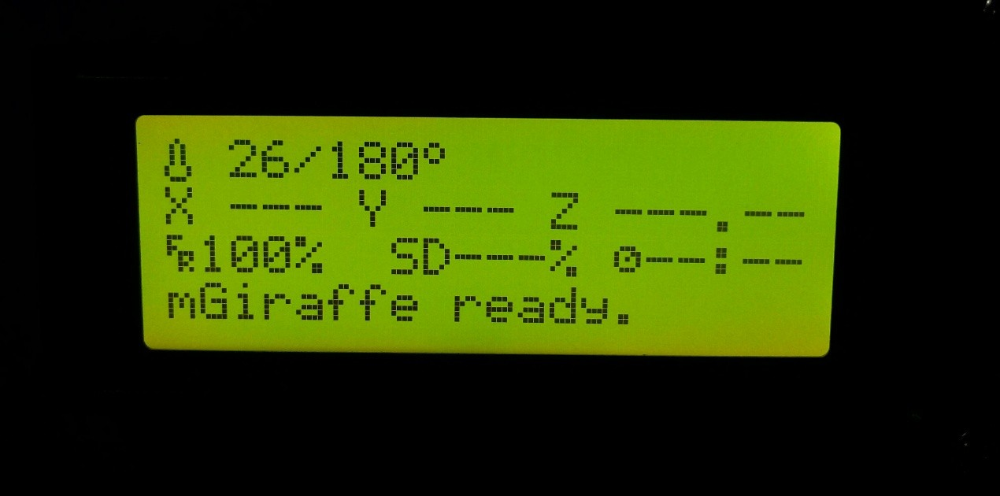
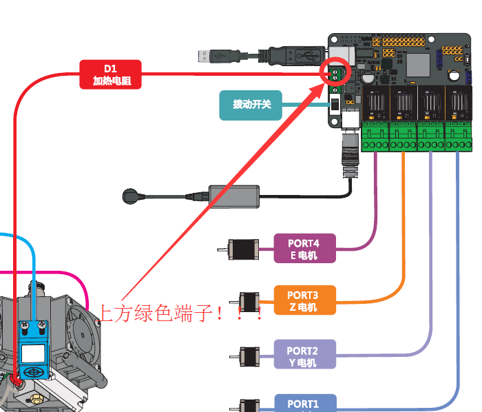
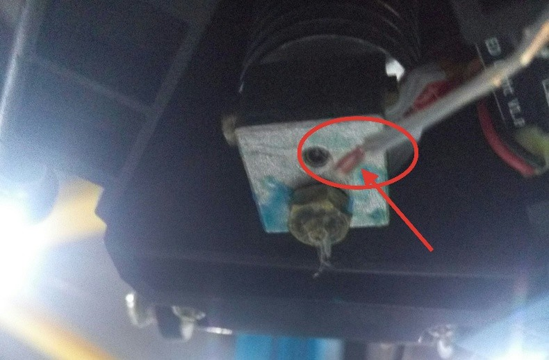
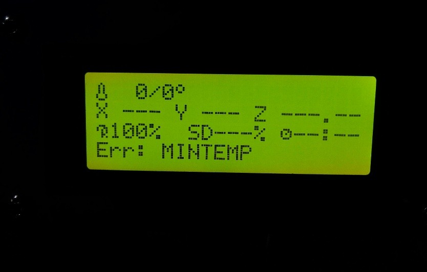
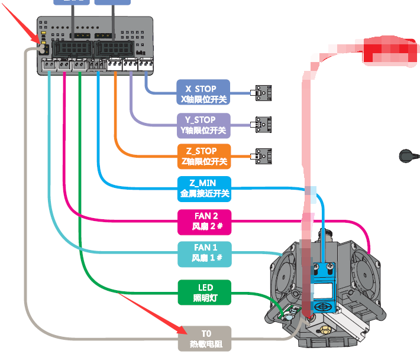

# 006\_为什么挤出机温度一直上不去？

> LCD 上挤出机的温度一直上不去,无法进行正常加热操作。由 LCD 上显示内容的不同，主要有以下两个原因。

**现象 ① 原因以及解决方法：**

一般这种情况是由于挤出机的加热器/棒（圆柱型器件）未正确连线，或者是热敏电阻暴露在了空气中。

 1、关于接线问题，可参考下图找到正确接线方式（靠近USB口的那个2-pin绿色端子）。

 2、热敏电阻暴露在了空气中（如下图红色箭头处）。

这时候的热敏电阻在测试的一直是空气中的温度（室温），虽然实际挤出机的温度一直在上升（但此时LCD 已无法正常读取其实际温度），这时候应立即关闭打印机，并将热敏电阻装回方形加热块中（利用六角扳手拧动加热块上无头螺丝），热敏电阻的正确安装位置如下图黑色箭头所示。

**现象 ② 原因以及解决方法：**

出现这种现象，表明挤出机热敏电阻线未正确连接，或者是热敏电阻损坏或者断路（罕见情况）。

首先检查热敏电阻是否未插入或者插错位置，正确连线如下图红色箭头所示（扩展板最左侧两孔）。

 其次，关于热敏电阻自身的问题，有条件的话，可用万用表量下电阻线是否存在断路现象，和测下热敏电阻阻值（100KΩ 左右）。

