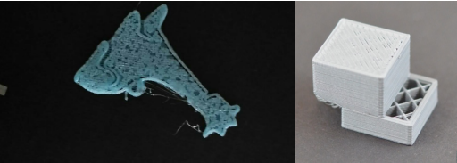
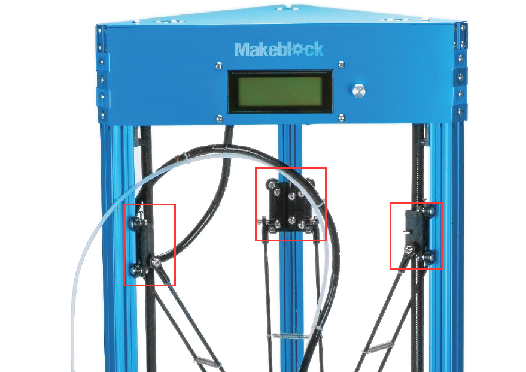
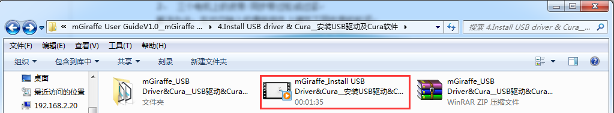
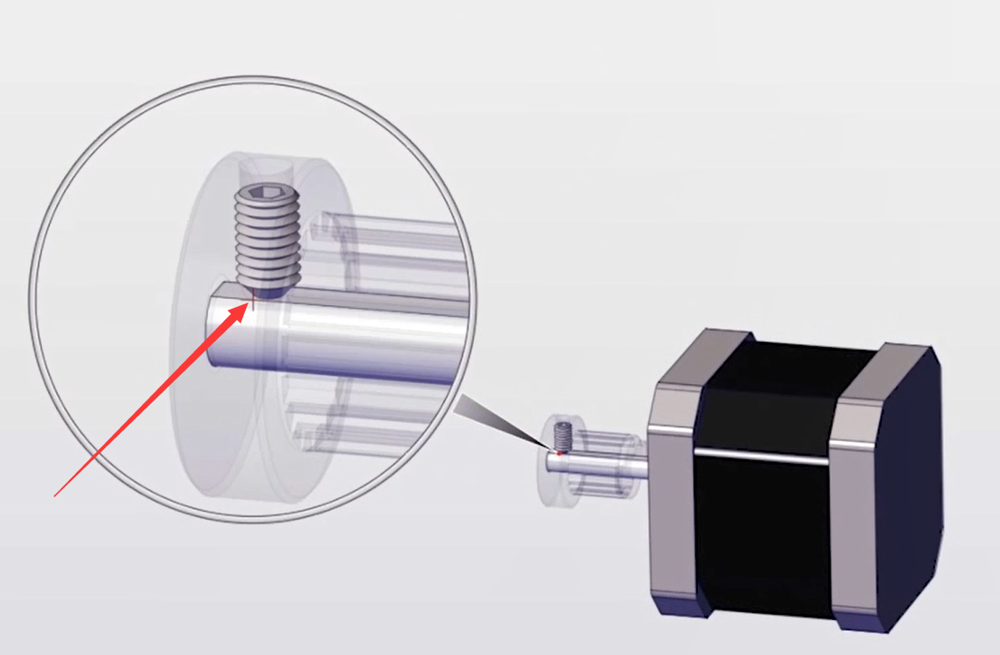
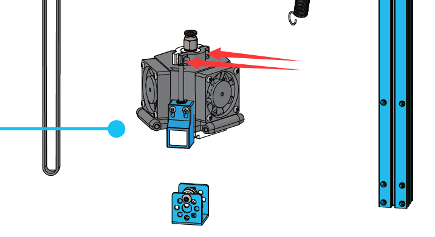

# 007\_如何提高打印质量？

#### 现象：

打印物体的质量特别糟糕，层与层之间衔接得不好，或者打印层出现错位的现象，如下图所示。

**原因 ①：打印平台没调平**

**解决方法：**参考[001\_如何对打印平台进行精确调平？](001-ru-he-dui-da-yin-ping-tai-jin-hang-jing-que-tiao-ping.md)对平台进行再次调平。

**原因 ②：三个电机上的皮带/同步带过松或过紧**

**解决方法：**在对应轴上的滑块组件处调节下同步带的松紧程度。

**原因 ③：未按要求导入官方配置文件**

**解决方法：**参考出厂自带 TF 卡里面的操作视频，重新在 Cura 里面导入打印机的默认参数配置。

**原因 ④：电机处的传动盘打滑，导致电机运动异常**

**解决方法：**检查 X、Y、Z 三个轴电机上面的无头螺丝，是否未对准D型面，重新拧紧螺丝看看。

**原因 ⑤：打印头倾斜**

**解决方法：**可以松开喷头组件的两颗固定螺丝（红色箭头所示），微调下看看。

