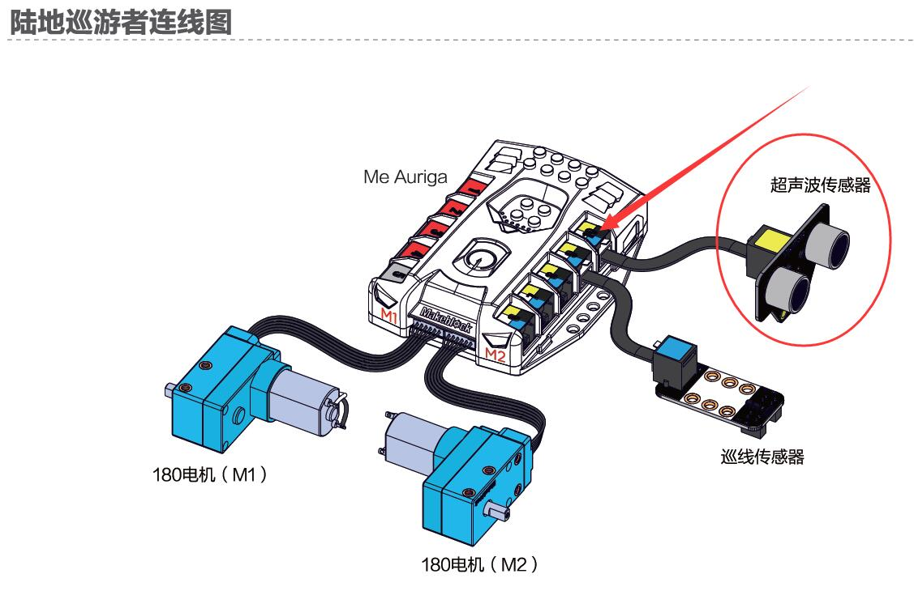

# 002\_避障模式为何工作不正常？

> 在使用超声波模块时，如果 Ranger 上已有避障程序，但是遇到障碍物时，还是出现不能避障的现象，可以对模块按顺序做如下的测试。

#### 1、 检查供电是否正常

首先，将超声波模块插上主板后，给主板上电，然后观察模块背面的「**PWR**」灯，正常工作的模块会有红灯亮起如下图：

####  2、检查接线是否正确

 如果第 1 步中的红灯正常亮起，还是无法实现避障，此时需要检查下接线，如果是出厂自带的避障模式，超声波模块应接在主控板的 10 号口，如下图所示：

如果出厂程序的巡线模式还是无法正常巡线，可尝试「恢复出厂程序」看下。

> 具体可参考[如何「恢复出厂程序」？](../tips/ru-he-hui-fu-chu-chang-cheng-xu.md)

#### 3、通过mBlock软件读取返回值

通过 mBlock 软件（[点击](http://www.mblock.cc/zh-home/software/mblock/mblock3/)下载）来读取巡线模块返回的数据，一共分为两步：

第一步，也是必备的步骤——「安装固件」

> 具体可参考[如何「安装固件」？](../tips/ru-he-an-zhuang-gu-jian.md)

 待「**安装固件**」完成后，在 mBlock 里编写如下程序（确保程序中超声波的接口与其实际接口一致）：

**点击绿旗让程序运行**，正常的话，超声波模块会根据障碍物的远近，返回0~400 其中一个数值。如果数据返回不成功，可重启 mBlock 再重复上述步骤看看。

