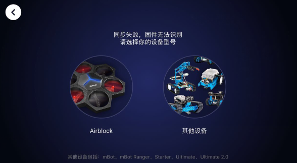

# 003\_连接 App 时，为何显示「固件无法识别」？

#### 现象：

连接 Ranger 和「makeblock」App 时，出现如下提示，导致二者无法正常连上。

#### 原因以及解决方法：

1、电池电量过低

推荐用 6 节全新南孚电池，或者官方可充电锂电池套装（如下图），放电能力相对来讲更强些，不推荐用使用充电干电池。

2、App 和机器人固件版本过低

针对 App 版本的问题，可前往软件应用商店下载最新版本（iOS 平台前往 app store 下载，安卓平台推荐用腾讯「应用宝」下载）。

针对机器人固件版本过低，可参考[如何「安装固件」？](../tips/ru-he-an-zhuang-gu-jian.md)为机器人升级最新固件。

