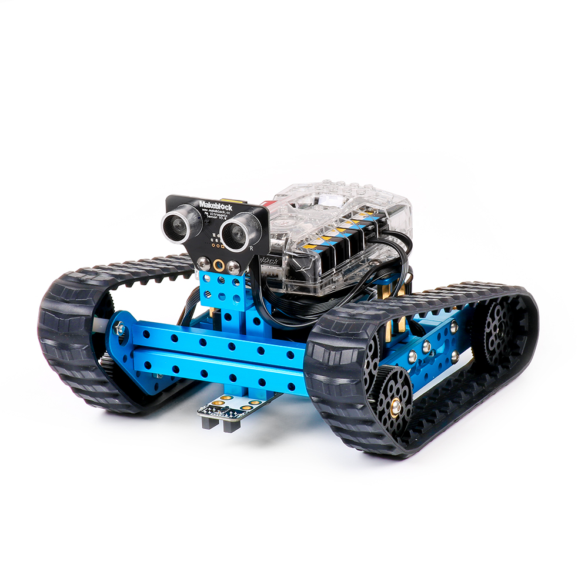

# 007\_使用 App 控制小车时，履带为何会脱落或卡得过紧？

#### 现象：

在组装好「陆地漫游者」形态（如下图），且电池电量充足的情况下，使用「makeblock」App 对其进行控制时，出现小车行走时履带脱落的情况，或者履带太紧导致小车无法正常行走的现象。

#### 原因及解决方法：

一般来讲，出现这个问题的原因，大多是安装时金属梁与金属梁之间的孔位对错、或者用错轮子导致的（该套件一共有 2 种不同尺寸的 8 个黑色轮子，「陆地巡游者」形态使用的是 6 个一样的尺寸较小的轮子）。

遇到这种现象，可参考包装内的纸质说明书或者「makeblock」App 内的「搭建手册」部分，对组装情况进行仔细检查，必要时可拆掉机械部分重新安装。

