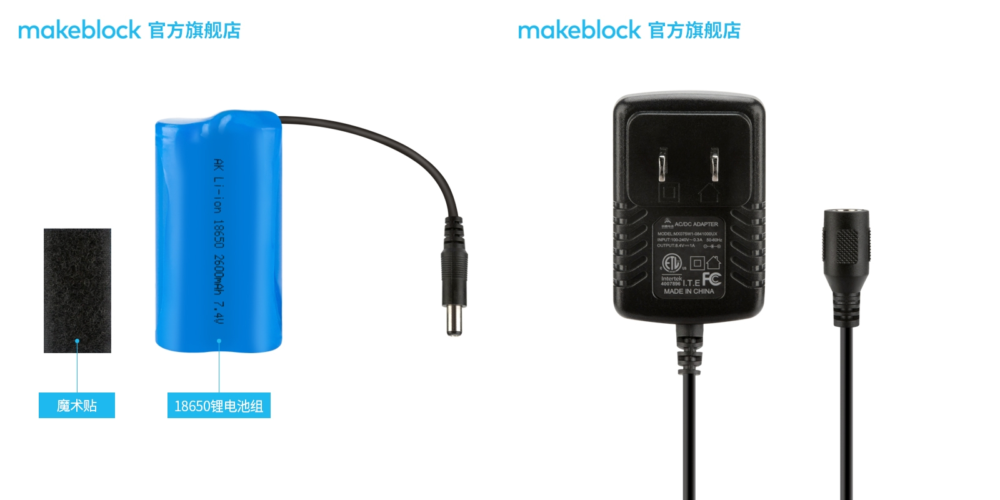

# 001\_机器人为何无法通过蓝牙连接上 App？

#### 现象：

机器人无法通过蓝牙连上「makeblock」App，或者连上后控制机器人运动时，机器人时走时停。

#### 原因：

一般这种现象出现的原因是，很大可能是电池放电能力不足。可通过以下方法，验证是否是电池供电问题：

拔掉电池跟主板相连的插头，然后找到官方的黑色方口 USB 数据线，将机器人连接至电脑，通过电脑的 USB 电压输出给主板供电，此时重新打开「makeblock」 App，与主板进行蓝牙连接，如果二者能够成功连上蓝牙，并且可以进入机器人的相应控制界面，可以确定是电池的供电问题。

> 验证过程中在软件控制界面，控制不了电机运动是正常现象，这是由于电脑的 USB 端口输出电压不足以驱动电机运动，但是足以给蓝牙模块供电了。

#### 解决办法：

* 如果已经买了官方的 18650 锂电池，建议充电后再重新连接 App 看下。
* 如果是使用 5 号干电池供电，建议购买 6 节全新的南孚电池（切勿新旧电池混用）。建议还是购买官方的 18650 锂电池套装（锂电池和充电器，如下图），相较于干电池，它的优势是可充电以便重复使用。

