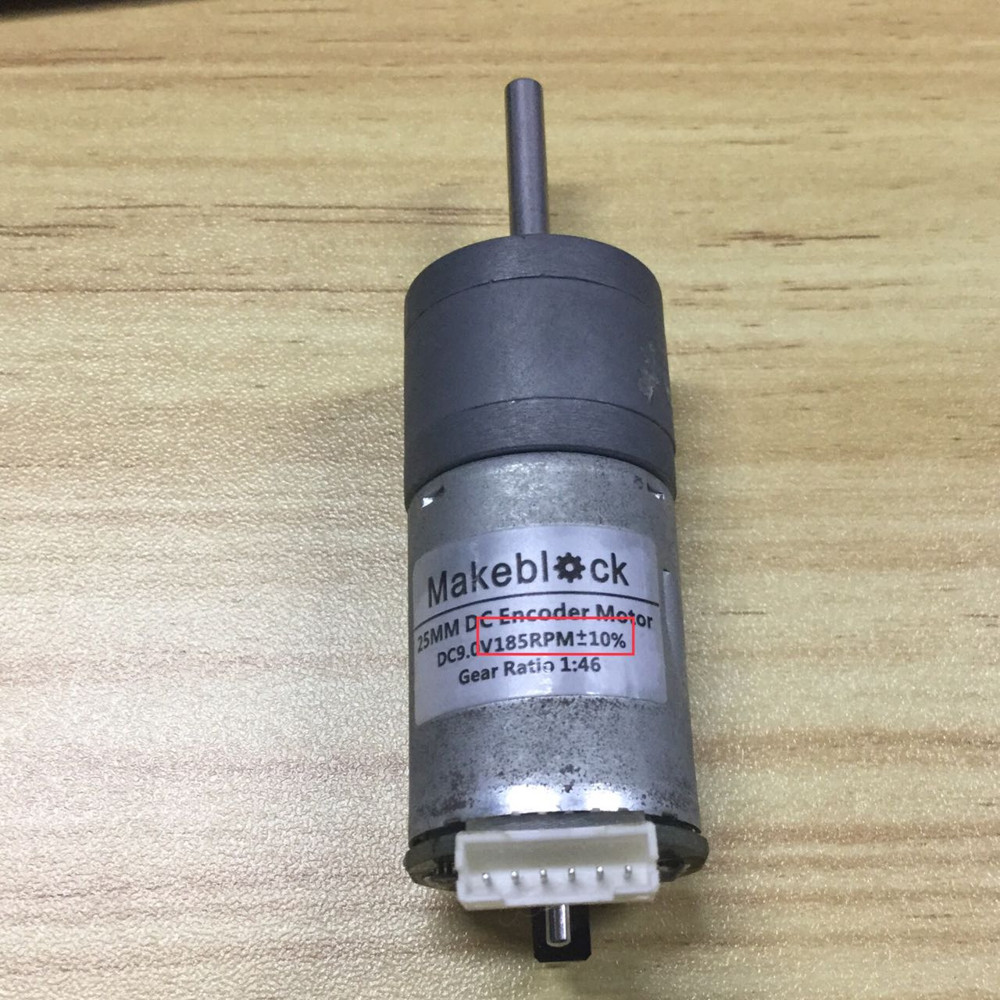
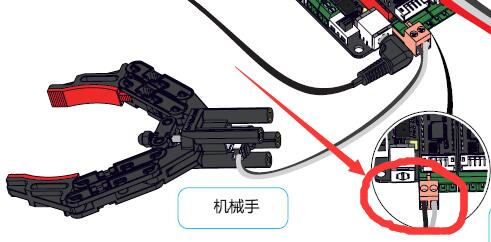

# 002\_通过 App 控制机器臂时，实际运动方向不一致？

#### 现象：

连接上「makeblock」App 后，选择「履带机械臂坦克车」模式后（如下图），控制界面点击「松开」、「夹取」和「放下」、「抬起」后，机械臂实际运动的方向与操作的不一致。如点击「松开」按钮后，机器臂实际却做了「夹取」的动作。

#### 原因：

机械臂抬起与落下方向有误，是因为用错电机导致的。而松开与夹取有误，则是因为电机线接错导致。

#### 解决方法：

1、针对抬起与落下方向有误的问题，检查下控制机械臂的编码电机是否用错。

**白色标签上参数（参考下图）为** **86RPM 的是用于机械臂的电机，参数为 185RPM 的是用于让机器人前进后退的电机**。  

2、针对机械爪抓取与松开方向有误的问题，在螺丝刀的辅助下，**交换下机械爪上橙色端子的黑白线**即可。

