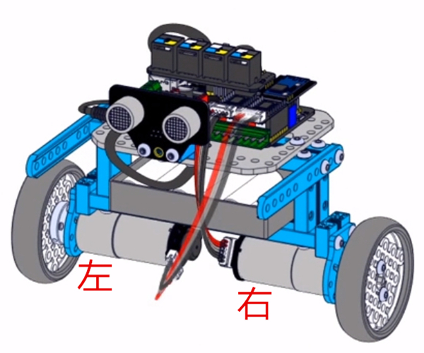
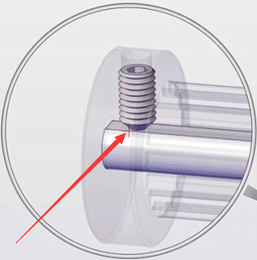
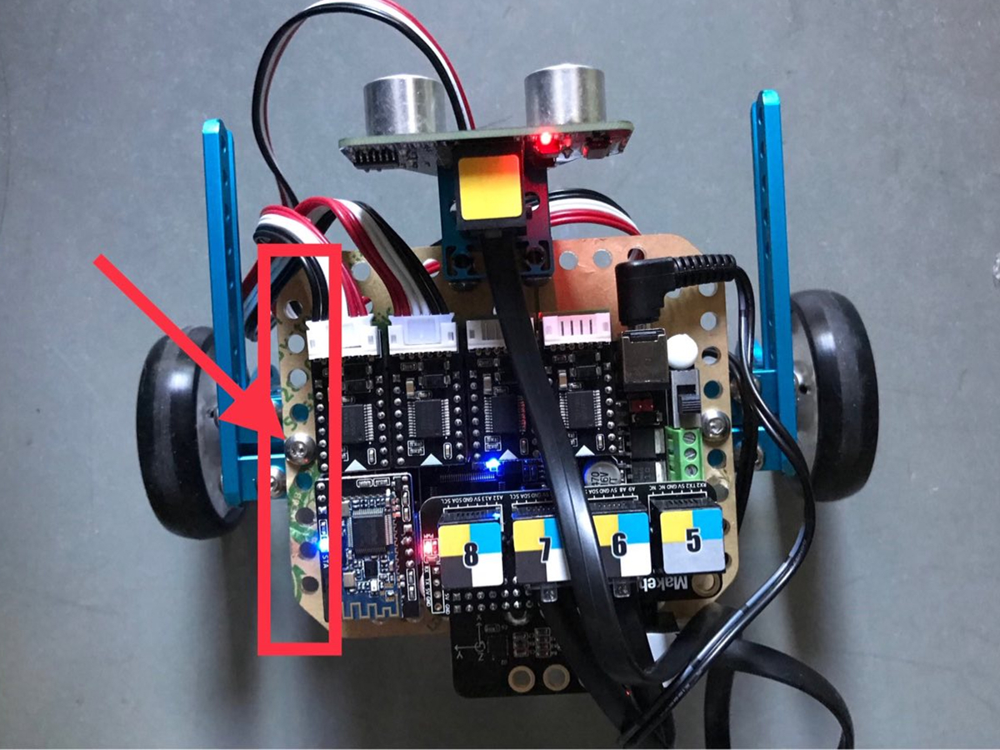

# 003\_平衡车形态为何无法正常工作？

#### **现象：**

在 ultimate2.0 的自平衡模式下，小车始终无法平衡，或者是只能平衡一小会儿，然后就摔倒了。

#### **原因：**

小车不能保持平衡的原因，大致有以下几种可能：电机用错、电机接错线、组装问题、电池供电不足等。

#### **解决办法：**

针对以上几个原因，可对照以下几点逐一检查。

1、俩电机的电机线插反了，正确的接线如下（将小车正对自己），左边的电机接的是主板的 PORT1 接口，右边的电机接的是 PORT2 接口：

2、 混用了 185 电机和 86 电机，平衡车形态使用的是两个 185 电机（ultimate2.0 里面有两个 185 电机，一个 86 电机），**可对照电机上面白色标签识别电机型号（如下图）**；

3、检查下左右两个电机上面的无头螺丝的安装情况，无头螺丝必须顶到电机轴的 D 型面，如下图所示：

4、 组装问题（金属梁孔位未对准、螺丝松动等）会导致重心不稳，进而影响自平衡形态时，电机无法正常调节动作，可对比安装指导再仔细检查一下。

> 以孔位问题为例，下图中的红色框中有 9 个圆孔，当用螺丝固定主板与金属梁时，螺丝必须处于第 5 个孔位——也就是正中间的孔位，否则就有可能导致重心不稳。

5、电池供电问题

* 如果是使用电池盒供电，记得用 6 节全新的南孚电池，切勿新旧电池混着用。
* 如果使用的是官方的18650 锂电池套装，建议给电池充会电后再试，同时调整下锂电池的安装位置看看。

