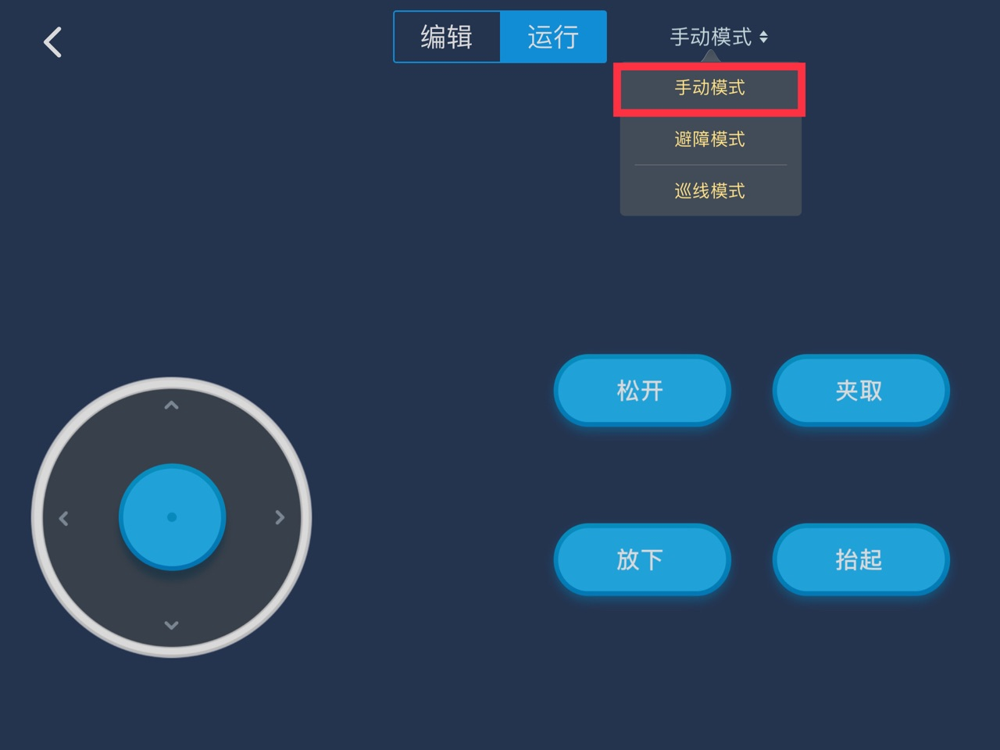

# 004\_为什么机器人一上电就到处乱跑？

#### 现象：

主板电源开关打开后，还未通过「makeblock」App 给机器人发控制指令，机器人就自己跑动起来了。

#### 原因：

出现这种现象，一般是因为组装形态切换导致的问题。比如你现在组装了「履带机械臂坦克车」形态，而在这之前你组装了 Ultimate 2.0 的其他形态进行试玩（如「自平衡机器人」、「探测机器人」等），此时虽然硬件部分（组装形态）切换过来了，但是软件部分（主板固件）由于主控板「记忆功能」的存在，还未成功从其他形态切换到「履带机械臂坦克车」形态来。

#### 解决方法：

通过手动选择机器人模式的方式，我们可以让主控板的固件从其他形态切换到当前形态（假定此时的组装形态为「履带机械臂坦克车」），只需以下三步即可成功切换：

1、打开机器人电源开关和「makeblock」App，二者进行蓝牙连接。

2、机器人和 App 连接成功后，进入「遥控」界面，选择「履带机械臂坦克车」模式。

3、进入该模式后，选择上方的「手动模式」即可。

