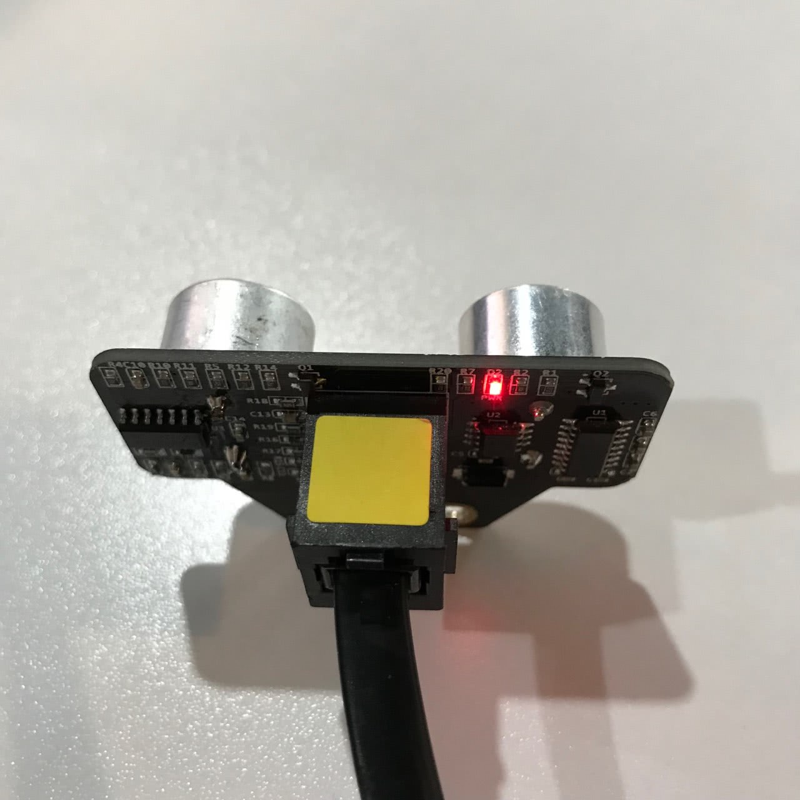

# 001\_避障模式为何工作不正常？

#### 现象：

当通过遥控器上面的 D 键切换到「避障模式」（红外版 Starter），或连接「makeblock」App后选择「避障模式」后（蓝牙版 Starter），小车在行走时遇到障碍物后，并不能自动躲开。

#### 原因：

引起这个现象的原因可能有多种，比如红外遥控器问题、超声波模块接错接口、小车的程序不是出厂程序等，还有可能是超声波模块自身的硬件问题，可根据以下方式逐步验证。

#### 解决方法：

1、恢复出厂程序

确保小车上的程序为出厂程序，以防万一，可参考[如何「恢复出厂程序」？](../tips/ru-he-hui-fu-chu-chang-cheng-xu.md)在 PC 端 mBlock 中恢复出厂程序（主控板选择记得选择「Orion」）。

2、检查模块硬件问题

确保超声波模块接在 Orion 主板的 3 号接口，此时给主板上电后，观察模块背面的「**PWR**」灯，正常工作的模块会有红灯亮起如下图：

1. 若超声波模块的指示灯未成功亮起，可换一根正常的 RJ25 线连接它和主板，若模块上的指示灯还是不亮，则为超声波模块自身硬件故障。
2. 若超声波模块指示灯成功亮起，可通过 mBlock 软件（[点击](http://www.mblock.cc/zh-home/software/mblock/mblock3/)下载）来在线读取巡线模块返回的数据，一共分为两步：

* 第一步，也是必备的步骤——「安装固件」，

  > 具体可参考[如何「安装固件」？](../tips/ru-he-an-zhuang-gu-jian.md)

* 待「**安装固件**」完成后，在 mBlock 里编写下图中的程序（确保程序中超声波的接口与其实际接口一致）。**点击绿旗让程序运行**，正常的话，超声波模块会根据障碍物的远近，返回 0~400 其中一个数值。

3、确定最终问题

根据超声波模块是否能正常实时反馈距离，可以确定问题所在。

1. 若程序运行后，超声波模块无法正常返回 0~400 的值，不排除是硬件问题，可多次验证上述步骤看下。
2. 若程序运行后，超声波可以正常返回 0~400 的数据，但是遥控器还是无法成功切换到避障模式，此时可参考[004\_为何红外遥控器控制机器人时，机器人毫无反应？](004-wei-he-hong-wai-yao-kong-qi-kong-zhi-ji-qi-ren-shi-ji-qi-ren-hao-wu-fan-ying.md)检查是否是由红外遥控器引起的问题。

