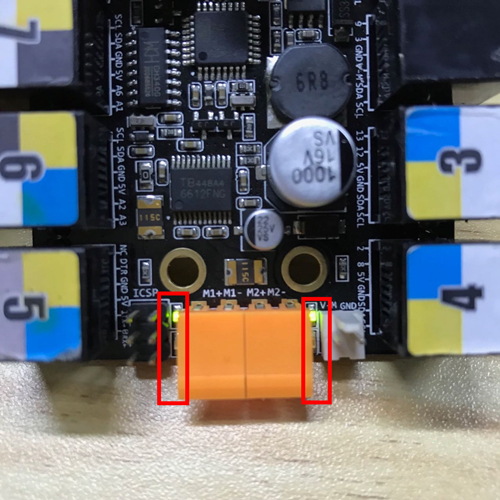
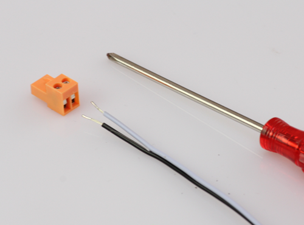
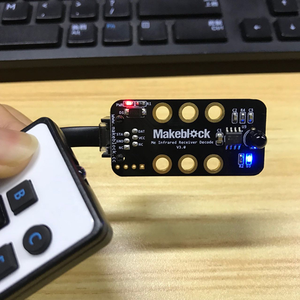

# 004\_为何遥控机器人时，机器人毫无反应？

以下测试均是基于 Starter 小车的出厂程序模式，所以可参考[如何「恢复出厂程序」？](../tips/ru-he-hui-fu-chu-chang-cheng-xu.md)先给小车恢复出厂程序。

#### 现象：

通过 App 或者红外遥控器操控小车时，小车上面的电机毫无动作。

#### 解决方法：

根据控制方式的不同，分为两种情况：

1、蓝牙版使用 App 控制时，电机毫无反应

* 如果小车通过蓝牙和 App 成功连接后，操控时小车毫无反应。可对主板上电机橙色电机端子旁的指示灯进行检查：若操控时，端子旁边的指示灯正常亮起（如下图一），但是电机不动作，此时可重新连接下电机线（如下图二，用螺丝刀拧松螺丝，将电机线重新插进去。防止只压到电机线外部塑料，而没有接到里面的线芯），用螺丝刀重新拧紧后供电看下。如若还是不行，可更换全新电池验证是否是供电不足的原因；

* 若操控时，橙色电机端子两旁的指示灯没有正常亮起，此时可重新恢复出厂程序后，再做测试。

2、红外版使用遥控器控制时，电机毫无反应

使用红外遥控器控制时，按下按键后，根据主板 6 号口上红外接收模块的指示灯（下图右下角蓝色灯）亮灭情况，分为两种情况。

* 当按下按键后，有蓝色指示灯亮起。表明遥控器功能完好。此时可检查红外接收模块的接线情况（看下是否正确地接在了主板的 6 号端口），并确保小车处于出厂程序模式下（「恢复出厂程序」的方法见文章开头处），同时检查第 1 条中的电机线和电池问题。
* 若遥控器按键按下后，蓝色指示灯未有亮起，可参考[006\_mBot 的红外遥控器为何不工作？](../mbot/006mbot-de-hong-wai-yao-kong-qi-wei-he-bu-gong-zuo.md)前 3 条检查红外遥控器的问题。

