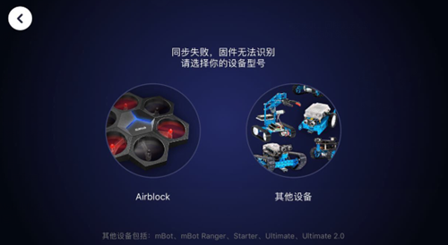
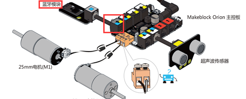

# 006\_蓝牙版 Starter 连接 App 时，为何出现「固件无法识别」提示？

#### 现象：

蓝牙版 Starter 连接上 Makeblock App 后，出现「固件无法识别」错误如下图。

#### 解决方法：

1、确保蓝牙模块接在了主控板的 5 号端口，如下图所示：

2、可能是电池放电能力不足，建议全部更换为新电池，最好为全新南孚电池或官方可充电 7.4V 锂电池套装（如下图），不建议使用普通充电电池。

3、升级最新版的 mBlock3 桌面端和 makeblock App

桌面端可[点击此处](www.mblock.cc)下载最新版本，安装好软件后，参考[如何「恢复出厂程序」？](../tips/ru-he-hui-fu-chu-chang-cheng-xu.md)给 Starter 升级到最新的出厂固件。

最新版 App 可从腾讯应用宝（安卓手机用户）或 App Store（苹果手机用户）获取。

