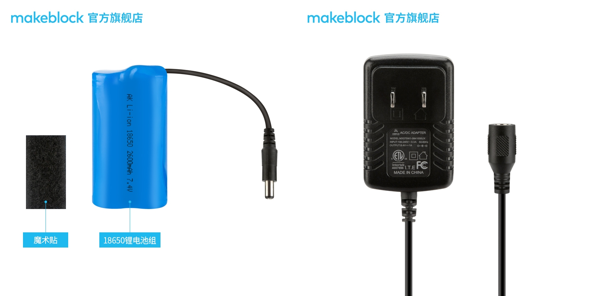

# 005\_为何控制小车移动时，主控板不断重启（指示灯快闪）？

#### 现象:

操控小车时，小车在移动过程中，出现时走时停的现象，并且主控板上的指示灯也不停地闪烁。

#### 原因及解决方法：

这种情况很大可能是电池供电能力不足引起的，电机一转动耗电量瞬间增加，导致主控板供电不足，进而引起重启。建议更换 6 节全新的南孚电池（供电能力较强），或购买官方的可充电 18650 锂电池套装（如下图）。

