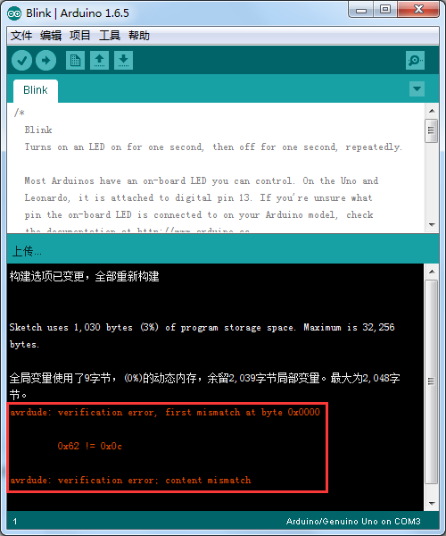
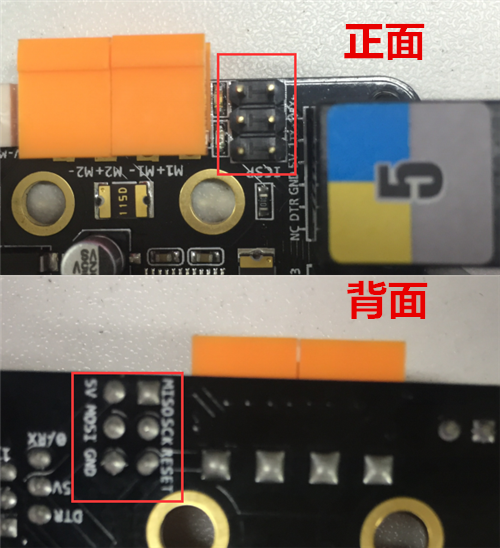
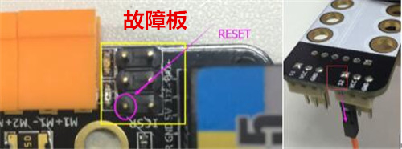
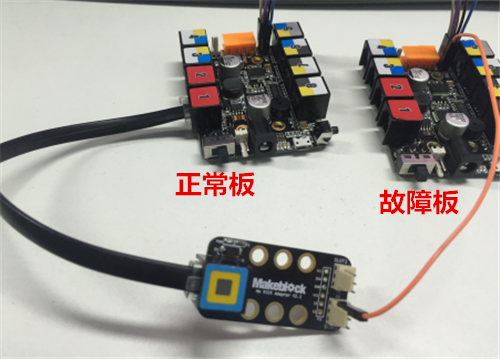
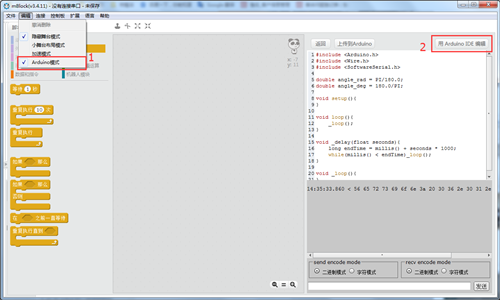
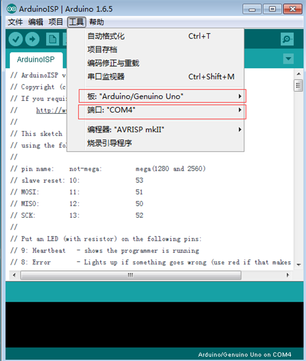
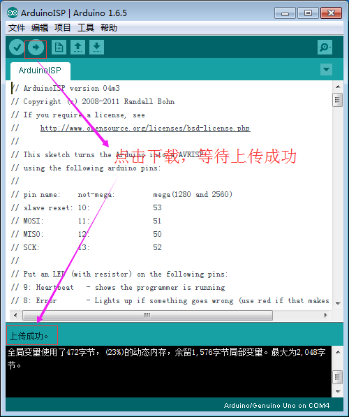
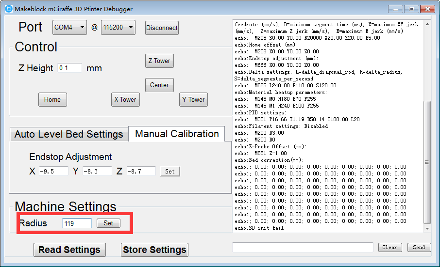

# 007\_如何给 Orion 主板恢复 BootLoader？

> 什么是 BootLoader 呢？简单地说，BootLoader 是一个程序，芯片上如果有 BootLoader，便可以直接把固件上传到芯片上，你就不需要 AVR ISP 烧录装置了。我们买的 Arduino 板子上的 ATMega 芯片都预先烧录了 BootLoader。
>
> 平常在用 Arduino IDE 的时候，我们不用准备 AVR ISP，而是直接通过 USB 接线方式就可以上传程序，之所以可以这么方便，全都是因为有 BootLoader 的关系。感兴趣的可以去网上查询更多资料，不感兴趣的直接按照下面的步骤操作即可。

#### 现象：

当在 mBlock3 里面上传程序出现「上传失败」提示时，我们会想到借助 Arduino IDE 来测试主板功能正常与否。那最常用到的测试程序，即是 Arduino IDE 里自带的「blink」示例程序。如果你在上传这个程序时，出现下图所示的错误提示，则意味着你主板的 BootLoader 由于某种原因丢失掉了。

#### 解决方法：

通过一块正常工作的 Orion 或 mCore 主控，加上杜邦线等工具， 可以将丢失 BootLoader 的主控恢复正常，下面是恢复过程需要的所有材料：

1. 双母头的杜邦线 \* 6
2. 丢失 BootLoader 的故障 Orion 主控 \*1（下文简称故障板）
3. 正常工作的 Orion 主控 \* 1（下文简称为正常板）
4. RJ25 转接模块 \* 1
5. RJ25 线 \* 1

Orion 主控与原生 Arduino Uno 主控的引脚对应关系如下：

| Orion/mCore 主控 | Arduino Uno 主控 |
| :---: | :---: |
| SCK | 13 |
| MISO | 12 |
| MOSI | ~11 |
| RESET | ~10 |
| 5V | 5V |
| GND | GND |

参考下面的图片找到我们要用到 Orion 主控的 6 个引脚：

那么问题来了，在哪个地方能找到上表中 10 号数字引脚呢？请看下面这张图，Orion 主板背面 1 号端口的位置，将芯片的数字引脚 10 扩展出来了。

接下来开始连线，将两块 Orion 主控的 SCK、MISO、MOSI、5V、GND 这 5 个引脚一一对应连接（RESET 引脚先不要连接），连接好的效果图如下。

用 RJ25 线连接 RJ25 转接模块到正常板的接口 1，然后将 RJ25 转接模块上的 S2 引脚通过杜邦线连接至故障板的 RESET 引脚，如下图所示。

完成接线后，接下来开始通过 Arduino IDE 进行 BootLoader 恢复操作。mBlock3 自带有 Arduino IDE 模式，参考下图进入。

进入 Arduino 模式后，将正常板用 USB 线连接至电脑，在「工具」菜单中选择好正确的主控板和串口，如下图所示。

> Orion 主控基于 Arduino Uno 开发，串口选择参考[如何查看主板的「COM口」？](../tips/ru-he-cha-kan-zhu-ban-de-com-kou.md)

选择「文件」菜单中的「示例」-&gt;「ArduinoISP」，如下图：

点击左上方的上传按钮，等待程序上传完成。

接下来选择「工具」菜单中的「Arduino as ISP」：

最后一步，选择「工具」菜单中的「烧录引导程序」，等待程序上传完成。

当你看到上图中的「烧录引导程序」完成字样，则表明故障板的 BootLoader 恢复成功，后续可以通过 mBlock 给之前的故障板正常上传程序了。

如若出现报错提示信息，请仔细检查两块主板之间的连线。

