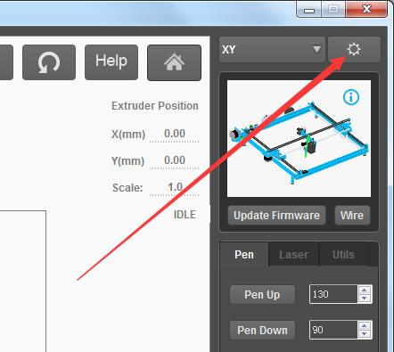
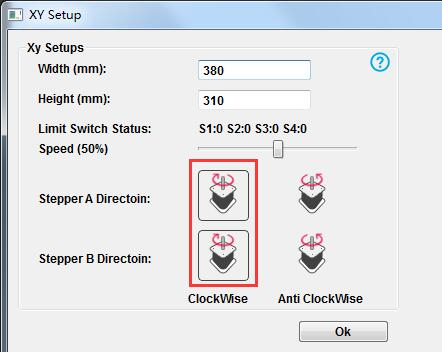

# 002\_为何画出来的图像是反的或歪的？

#### 一、图像画歪的原因

1. 检查下 X 轴和 Y 轴上皮带的松紧状态，尽量紧一些；
2. 轻轻摇晃画笔，观察画笔是否有松动，可以将相关螺丝拧紧下看看；
3. 确保锁紧步进电机轴的无头螺丝处于拧紧的状态，可以尝试重新拧紧下；

> 注：这类问题与机械结构类强相关，需要重点检查。

#### 

#### 二、图像画反的原因

* 这部分内容**仅针对 mDraw**，可能软件里步进电机设置了电机反转，应将其保持默认状态，默认状态如下图：

