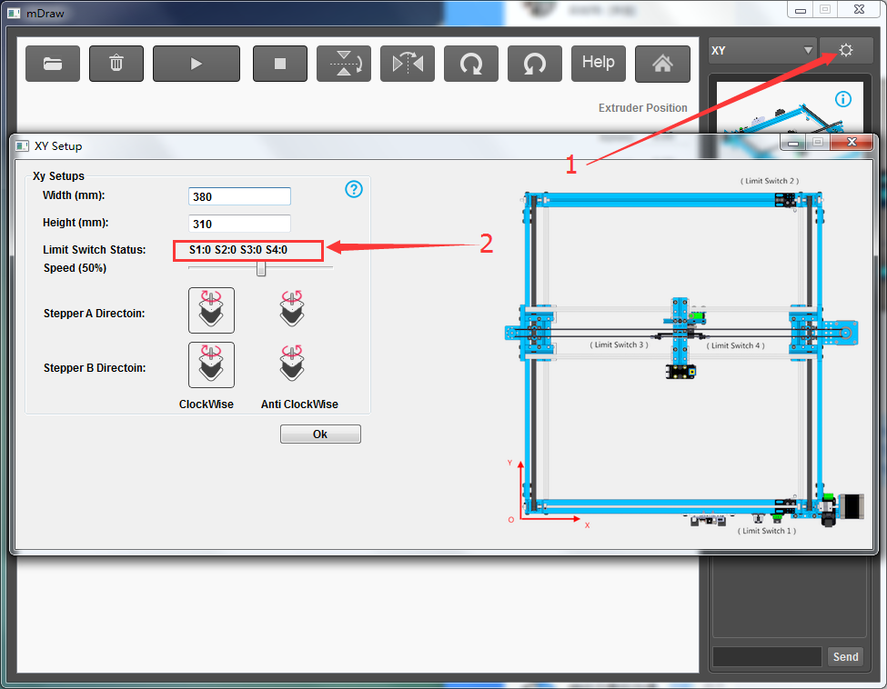
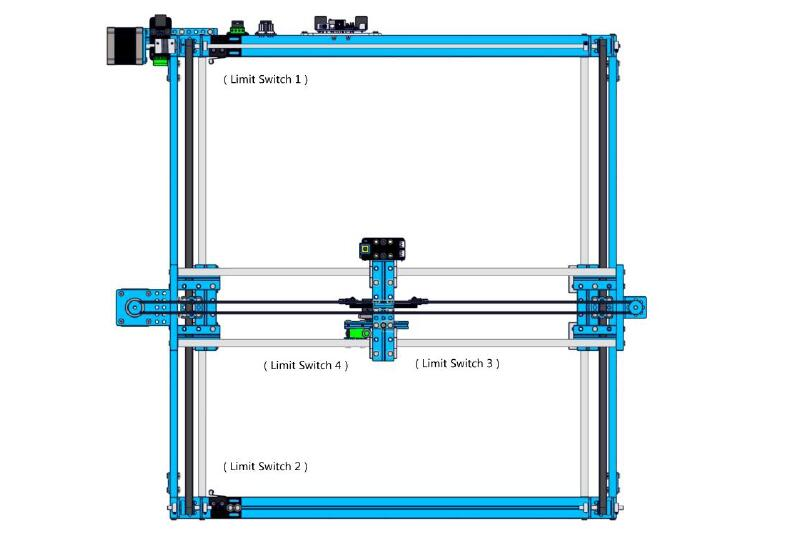
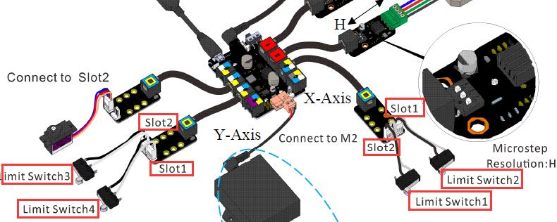
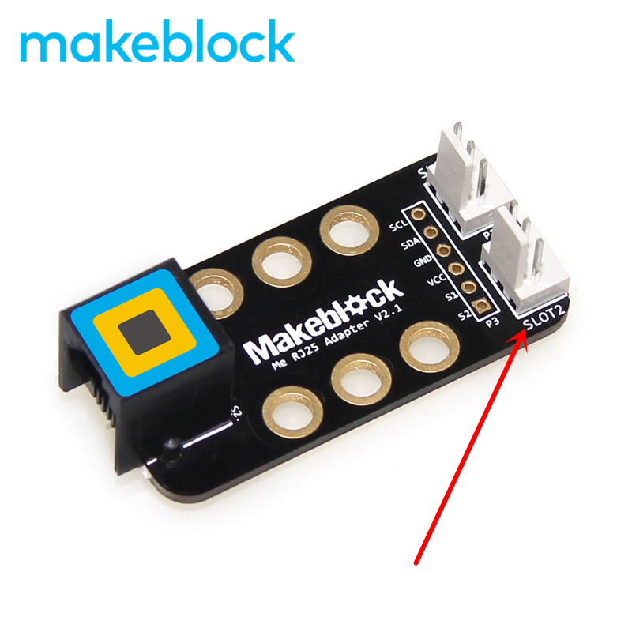
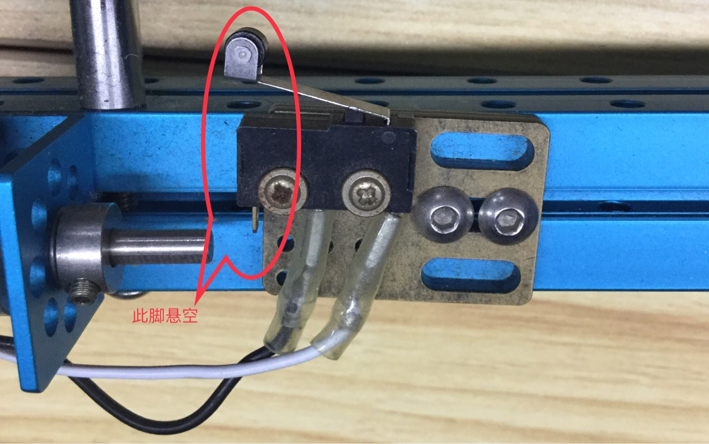

# 003\_为什么机器无法正常复位到原点？

> 复位功能只有 mDraw 才有，所以此部分内容适用于 mDraw 软件。

#### 一、机器无法复位

#### 出现这个现象，一般是由于限位开关工作不正常引起的。我们可以在 mDraw 里面检查限位开关的状态切换是否正确，来验证它是否工作正常。

具体操作为：

1. 在已给主控板烧录过固件的前提下，将主控板电源开关打开（并且外接官方 12 V 的电源适配器）；
2. 使用 USB 线将主板连接至电脑，打开 mDraw 软件并打开参数设置（下图位置 1）；
3. 通过分别按压和松开四个限位开关，看看 S1、S2、S3、S4 这几个参数是否能正常完成 0 和 1 两个状态之间的切换（下图位置 2）。**正常工作状态为：按下限位开关是 0，松开限位开关是 1。**

如果上述四个 S 参数均能完成 0 和 1 的状态转换，那么所有限位开关均工作正常，请直接看**第二条**。如果四个参数中，某个 S 参数不能顺利完成状态转换，那么继续往下看。

1、检查限位开关与主板之间的接线，每个限位开关的接线都是唯一的，所以接错线可能会导致限位开关不能正常工作。具体接线可参考下面两张图：

> 注：限位开关跟 RJ25 转接头接线时，一定要注意模块上的丝印——Slot1 和 Slot2（如下图）

2、检查限位开关上黑白线的接法，悬空引脚一定要跟下图一样，否则限位开关可能无法工作。

3、通过 mBlock 软件测试限位开关自身硬件的好坏：**在软件里「安装固件」后编写如下测试程序**（确保限位开关的硬件接口与你程序中的接口一致）。点击绿旗运行程序后，正常的限位开关工作状态如下：当你按下或松开限位开关时，熊猫说的值会在 0 和 1 之间切换（如下图）。

> 「安装固件」具体步骤可参考[如何「安装固件」？](../tips/ru-he-an-zhuang-gu-jian.md)，**主控板记得选择 Orion**。

#### 二、机器不停撞击边框

1、当连接好串口，点击复位按钮后，机器的中间部分不断撞击边框。很大可能是因为，有东西（一般是连接线）阻碍了限位开关触碰金属边框这个动作，可以从这方面排查下。

2、参照步骤一重新检查下限位开关的接线。

