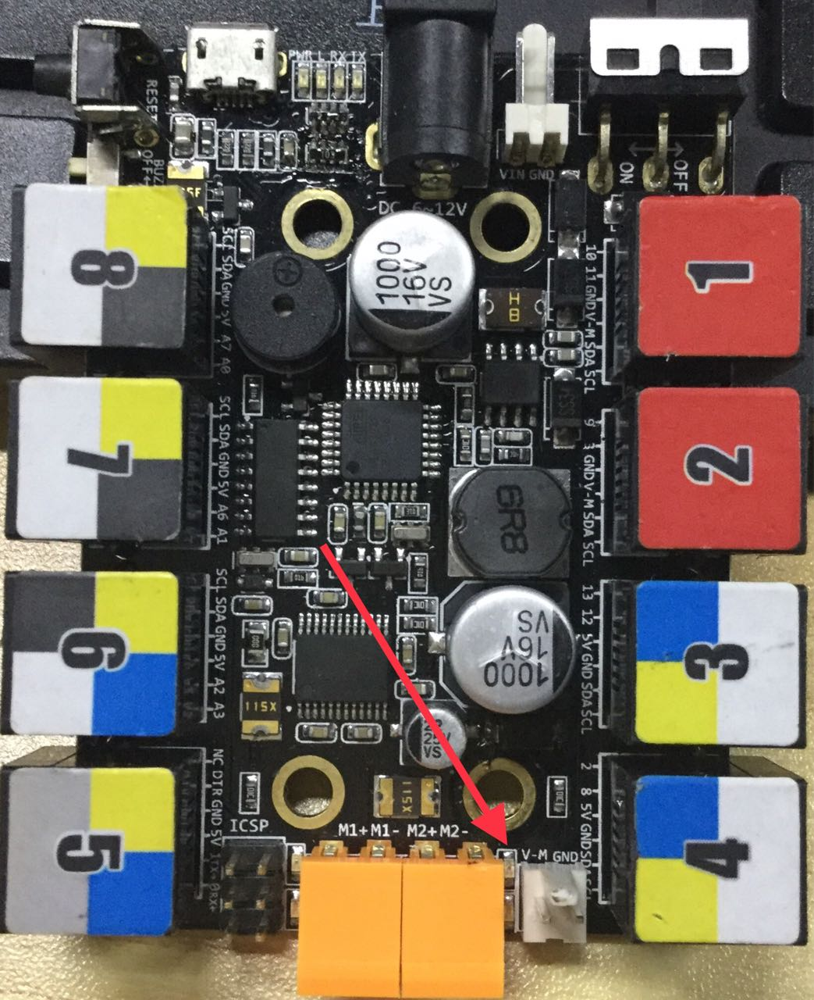

# 004\_为什么激光很弱甚至不亮？

1、激光线应接在主板的 M2 口上（橙色端子），并且确保接线端子不要压到线皮；

2、在软件里面打开激光后（打开方式见使用说明书），正常的话主板上 M2（橙色端子）位置 LED 指示灯会常亮，如指示灯未亮可重刷固件看下；

3、确认好步骤1、2之后，如激光头还是不亮，可以尝试调换激光的正负线（接在主板橙色端子上的两根线）；

4、确保激光对好焦，带防护眼镜将激光焦点调到最小为适宜；

5、也可单独测试激光是否是良品：把主板 12V 的电源直接接在激光接头上，发出的亮度可以烧穿 A4 纸才正常。

> **注：切记不要让激光长时间保持 12V 电压上。**

