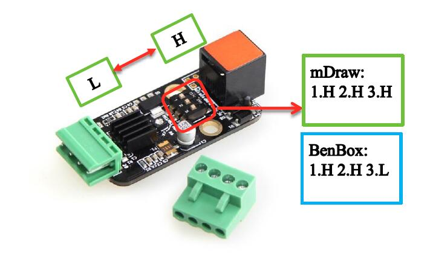

# 008\_在 mDraw 和 Benbox 之间切换时，需要做哪些调整？

#### 1、固件更新

XY 绘图仪在 mDraw 和 Benbox 里面用的固件是不一样的，所以每次在切换软件时，都是需要重新更新固件的，固件更新的具体步骤可参考说明书的相应部分。 

#### 2、驱动细分调整

另外，由于 XY 绘图仪在两个软件里使用的步进电机细分不一样，所以在切换软件时，**2 个步进电机驱动模块**上面的细分也需要调节，**mDraw 的细分设置为 HHH，Benbox 则为 HHL**。

#### 3、抬落笔角度调节

默认的抬笔、落笔角度参数在 mDraw 和 Benbox 这两个软件里是不一样的，所以在进行软件切换时，抬笔、落笔这俩参数也需要进行重新调节（调节方式见使用说明书），否则可能会出现画笔落不到纸上或刮纸的现象。

> [点击下载](http://bbs.makeblock.com/forum.php?mod=attachment&aid=NjIwNHw1Y2U0ODJhMXwxNTM5MDU2Mzg0fDB8MzMyMQ%3D%3D) XY 绘图仪的详细使用说明。

