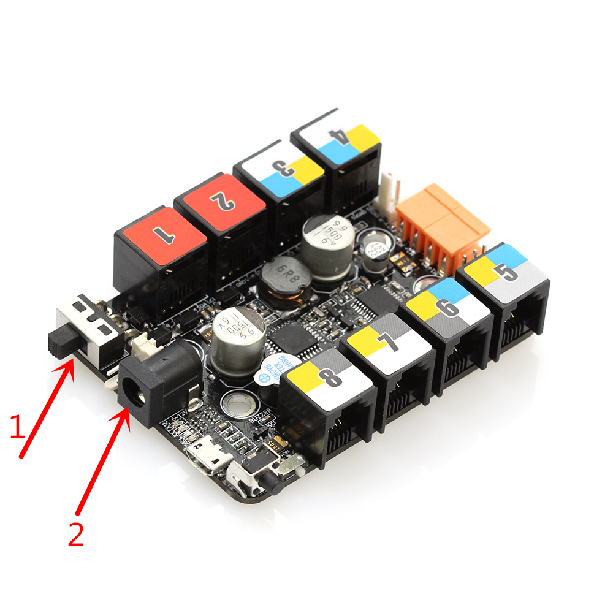

# 001\_为何电机不运动或者运动不规律？

1、确保下图中 2 处的 12V 电源适配器已经接上，且 1 处的电源开关已经打到了 **ON** 位置：

2、检查是否对绘图仪进行了固件升级操作，每次切换 mDraw 和 Benbox 使用时，都需要对绘图仪进行这一步骤，以下是「**固件升级**」按钮在两个软件中的位置：

> 「固件升级」的具体步骤可参照 XY 绘图仪说明书中的相关部分

3、检查下图中的「**串口**」参数是否选对（以 mDraw 界面为例），具体可参考[如何查看主板的「COM口」？](../tips/ru-he-cha-kan-zhu-ban-de-com-kou.md)

4、分别检查下两个步进电机的驱动细分，**使用 mDraw 时细分为 HHH，而在使用 Benbox 软件时，细分应为 HHL**，如下图所示：

5、 检查两个电机驱动模块的安装：是否和金属梁误触导致短路现象，此现象可采取先将模块从金属梁取下后，然后再重新测试电机运动的方式来验证。

6、关于硬件部分的故障排查，可采取交叉验证的方式。如交换两个电机的接线、交换两个电机的电机驱动模块等。

